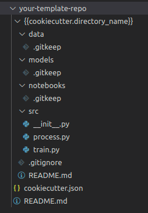
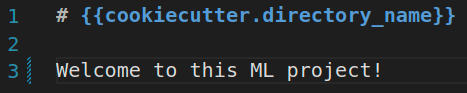
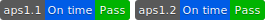

# Standards - Aps01 - Part 2

Now that we've defined a repository standard, it would be nice to reuse it in new projects.

For that we will use `cookiecutter` to define a **template repository**. Then, when a new ML project is started, we will just use our template to start it.

## Accept assignment

In order to do this, you will need to [**Accept the part 2 of the assignment**](https://classroom.github.com/a/UsnWz52t). We will use this repository as our ML repository template for new projects.

!!! danger "Atention"
    Please note that **APS 01** is divided into **two assignments**!

## Task 01: Create a template

Then, clone the repository in you machine and create a folder structure similar to:



!!! danger "Attention"
    
    Yes, the directory name is `{{cookiecutter.directory_name}}`
    

!!! info "Info!"
    The `.gitkeep` are empty files created to allow empty folders to be in the template

!!! exercise "Question"
    Create a `README.md` (root directory) with some basic informations of the template repository

!!! exercise "Question"
    Create the `cookiecutter.json` with the content:

    ```json
    {
        "directory_name": "project-name",
        "author_name": "Your Name",
        "compatible_python_versions": "^3.8"
    }
    ```

!!! exercise "Question"
    Create the `.gitignore` inside  `{{cookiecutter.directory_name}}`  with the files to be ignored by default in future projects.

!!! exercise "Question"
    Create the `README.md` inside  `{{cookiecutter.directory_name}}`  with the default **README** for future projects. Be creative!

    

    Think about the useful information that is expected to be in the **README** of any and every project!

!!! exercise "Question"
    Create basic python files in  `{{cookiecutter.directory_name}}/src`  folder.

    These files would be generic files, extensively edited by developers who will use your template in many different projects. Just give a basic idea of ​​the pattern you expect data scientists to follow when doing preprocessing or model training.

!!! exercise "Question"
    You can also leave some notebooks with basic code for exploratory data analysis.

!!! exercise "Question"
    Commit and push your changes to Github!


### Task 02: Testing your template

Install `cookiecutter`:

<div class="termy">

    ```console
    $ pip install cookiecutter
    ```

</div>

Then use the command:

!!! danger "Atention"
    Replace `your_template_repository` with the **REPOSITORY NAME** of your template repository.

<div class="termy">

    ```console
    $ cookiecutter https://github.com/insper-classroom/your_template_repository --checkout main
    ```

</div>

Done! It should create the folders and files structure defined in the template.

!!! danger "Remember!"
    Delivering the assignment is the same as pushing to the `main` branch of your private repository of `aps01-part2` and releasing a **tag**!

## Release APS01 Part 2!

!!! exercise
    In the repository created for part 2 of the APS, configure the webhook the same way as in part 1.

!!! exercise
    In the repository for part 2, submit the activity by creating a `aps1.2.x` tag, replacing `x` with any number.

    <div class="termy">

    ```console
    $ git tag -a aps1.2.1 -m "release my template for autograding"
    $ git push origin aps1.2.1
    ```

    </div>


!!! exercise
    Check the repository for issues and solve then!

!!! exercise
    Check the test status API.
    
    Feel the *dopamine release* as you check that both APS1 activities are **<span style="color:green">green</span>**  and passing the tests!

    

!!! info "Important!"
    Each part of APS1 is configured in an all-or-nothing format. Each part contributes `5` to the grade (only if passed all tests for that part).
    
    Therefore, the possible grades are `0`, `5` (only one part completed), or `10`.

## References
- https://cookiecutter.readthedocs.io/en/1.7.2/README.html