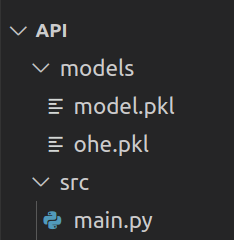

# Model Deployment

## Categories of Model Deployment

A core choice you'll need to determine that will impact both your customer base and the engineers constructing your solution is how it **computes** and **provides its forecasts** to consumers: **online** or in **batches**.


**Online** prediction is when predictions are generated and returned as soon as *requests* for these predictions are received by the service. This baseline selection on synchronous or asynchronous predictions will shape many subsequent designing decisions.

!!! info "Info!"
    In the literature, these topics can be referred to as **Batch Inference** *vs* **Online Inference**

The main advantage of **online** prediction is that it makes it easier to provide a **real-time user experience**. Suppose that you deployed an AI model for customer claiming and that the model makes predictions for all customers overnight. During the day, things like sending messages to the call center (indicating that the customer is dissatisfied) or placing new orders (perhaps indicating that the customer is satisfied) may happen.

Making the prediction closer to when it is needed makes possible the use of **newer information** and maybe return a more reliable and **valuable forecast**.

When online prediction is the choice to deploy a model, it is generally made available to other applications through **API calls**. In this handout, we are going to build an API to make predictions using the model from the last class.

## When is this decision made?

Remeber the ML lifecycle from last class:


!!! exercise choice "Question"
    In which of these phases should the decision to deploy in **batch** or **online** be made?

    - [X] Plan
    - [ ] Operations
    - [ ] Model Deployment
    - [ ] Data preparation
    - [ ] Model Evaluation

    !!! answer "Answer!"
        This decision depends on **how the model will be used**. It is usually possible to have a vision of this during the **planning** phase.
        
        It's something that can be rethought and changed, but generally **knowing the company's problem** (and the target variable to be predicted) already gives us an idea which style of deployment will **generate more value** for the business.

## What are APIs?

**APIs** (**Application Programming Interfaces**) allow developers to access data and services. They enable platforms, applications and systems to connect and interact with each other.


You can use APIs to:

- Transcribe audio using Google API
- Make an App that interact with ChatGPT
- Let an App send data to your ML models make and return predictions
- And so forth!

Some usefull links:

- https://www.redhat.com/en/topics/api/what-are-application-programming-interfaces
- https://aws.amazon.com/pt/what-is/api/

## Build an API

We are building our **API** using **FastAPI**. Follow the steps in the handout and refer to the official [FastAPI tutorial](https://fastapi.tiangolo.com/tutorial/) for additional guidance.

!!! info "Tip!"
    Create a repository (public or private) in your own github account to store your API.
    
    It is not necessary to submit the activity for this class.

!!! danger ""
    Use the environment (**conda** or **venv**) from the last class or create a new one for this class!

### Install libs

Let's install the necessary libraries:

<div class="termy">

    ```console
    $ pip install fastapi==0.112.0
    $ pip install uvicorn==0.30.6

    ```

</div>

Then, create a folder called `src`:

<div class="termy">

    ```console
    $ mkdir src
    ```

</div>

### A simple API

Copy and paste this code in the `src/main.py` file:

```python
from fastapi import FastAPI

app = FastAPI()

@app.get("/")
async def root():
    return "Model API is alive!"

```

Inside `src`, start the api with the command:

<div class="termy">

    ```console
    $ uvicorn main:app --host 0.0.0.0 --port 8900 --reload
    ```

</div>

<br>
To test, go to [**http://localhost:8900**](http://localhost:8900) in your browser!

One of the wonders of fastapi is the availability of documentation. Go to [**http://localhost:8900/docs**](http://localhost:8900/docs) in your browser. You will see something like:


Click on **"Try it out"**!

## An API that makes predictions

In the root folder of today's class, create a new folder called `models`:

<div class="termy">

    ```console
    $ mkdir models
    ```

</div>

We are going to store in this folder the pickle of the models trained in the last class.

!!! exercise
    Copy the `ohe.pkl` and `model.pkl` files from the last class activity to the models folder of today's class.

Now, your folder should have the following structure:



Then, create the `src/model.py` file. In addition to importing the necessary libraries, this file must have two functions that open (and return) the models contained in the `ohe.pkl` and `model.pkl` files.

```python
def load_model():
    # Your code here
    pass


def load_encoder():
    # Your code here
    pass
```

!!! danger ""
    These functions will be imported and used in `main.py`!

Here it is a new (and incomplete) version of `main.py`:

```python
from fastapi import FastAPI

# loader functions that you programmed!
from model import load_model, load_encoder


app = FastAPI()


@app.get("/")
async def root():
    """
    Route to check that API is alive!
    """
    return "Model API is alive!"


@app.post("/predict")
async def predict():
    """
    Route to make predictions!
    """
    # Load the models
    ohe = load_encoder()
    model = load_model()

    return {"prediction": "I can almost make predictions!"}
```

!!! exercise "Question"
z

To make predictions, the `predict` route needs to receive information about the client (**person**). When analyzing a row of the `X` table from the last class (before applying the encoder), an example of the necessary features using *JSON* format would be:

```json
{
  "age": 42,
  "job": "entrepreneur",
  "marital": "married",
  "education": "primary",
  "balance": 558,
  "housing": "yes",
  "duration": 186,
  "campaign": 2
}
```

Let's represent the person/customer information using a class identified as **"Person"**. Here's an example with the first two fields:

```python
from pydantic import BaseModel

class Person(BaseModel):
    age: int
    job: str
```

Now we can update the `predict` route to receive a person's information!

```python
@app.post("/predict")
async def predict(person: Person):
    """
    Route to make predictions!
    """
    ohe = load_encoder()
    model = load_model()

    df_person = pd.DataFrame([person.dict()])

    person_t = ohe.transform(df_person)
    pred = model.predict(person_t)[0]

    return {"prediction": str(pred)}
```

!!! exercise
    Complete the remaining fields of the **Person** class in the `main.py` file. Remember to import BaseModel at the beginning of `main.py`!

Return to **http://localhost:8900/docs** in your browser and test the `predict` route, adding the JSON content you saw earlier!


!!! help "Tip!"
    Deploying many **online** ML systems is conceptually simpler since the records to be scored can be distributed between several machines using a load balancer. But this is a problem for another day!

### Improve route with example!

Let's add an example to the code so that the documentation is already pre-populated with an example, making it easier for the user to test the route.

```python
from typing import Annotated
from fastapi import FastAPI, Body

@app.post("/predict")
async def predict(
    person: Annotated[
        Person,
        Body(
            examples=[
                {
                    "age": 42,
                    "job": "entrepreneur",
                    "marital": "married",
                    "education": "primary",
                    "balance": 558,
                    "housing": "yes",
                    "duration": 186,
                    "campaign": 2,
                }
            ],
        ),
    ],
):
    """
    Route to make predictions!
    """
    ohe = load_encoder()
    model = load_model()

    person_t = ohe.transform(pd.DataFrame([person.dict()]))
    pred = model.predict(person_t)[0]

    return {"prediction": str(pred)}
```

### Call API from Python!

If another application needs access to the API, it can simply make a request.

See an example using route `/` (check if is alive):

```python
import requests as req

print(req.get("http://localhost:8900/").text)
```

And for the `predict` route:

```python
import requests as req

data = {
    "age": 42,
    "job": "entrepreneur",
    "marital": "married",
    "education": "primary",
    "balance": 558,
    "housing": "yes",
    "duration": 186,
    "campaign": 2,
}

resp = req.post("http://localhost:8900/predict", json=data)
print(f"Status code: {resp.status_code}")
print(f"Response: {resp.text}")
```

### Add Authentication

Without proper authentication, APIs would be vulnerable to unnecessary access attempts and even malicious attacks from unauthorized parties.

For simplicity, let's assume there is only one valid token (`"abc123"`) as the full implementation of authentication would need database access and caching for performance.

Let's add a **dependency** to the `predict` route. When the route is called, the function that resolves the dependency will extract the token from the header check if it is valid:

The function and the route (I removed the example for simplicity):

```python
def get_username_for_token(token):
    if token == "abc123":
        return "pedro1"
    return None

async def validate_token(credentials: HTTPAuthorizationCredentials = Depends(bearer)):
    token = credentials.credentials

    username = get_username_for_token(token)
    if not username:
        raise HTTPException(status_code=401, detail="Invalid token")

    return {"username": username}

@app.post("/predict")
async def predict(person: Person,
                  user=Depends(validate_token)
                 ):
    # Code supressed
    pass
```

The full code is:
```python
from fastapi import FastAPI, HTTPException, Depends, Body
from fastapi.security import HTTPAuthorizationCredentials, HTTPBearer
from pydantic import BaseModel
from typing import Annotated
from model import load_model, load_encoder
import pandas as pd

app = FastAPI()

bearer = HTTPBearer()

def get_username_for_token(token):
    if token == "abc123":
        return "pedro1"
    return None


async def validate_token(credentials: HTTPAuthorizationCredentials = Depends(bearer)):
    token = credentials.credentials

    username = get_username_for_token(token)
    if not username:
        raise HTTPException(status_code=401, detail="Invalid token")

    return {"username": username}

class Person(BaseModel):
    age: int
    job: str
    marital: str
    education: str
    balance: int
    housing: str
    duration: int
    campaign: int

@app.get("/")
async def root():
    return "Model API is alive!"

@app.post("/predict")
async def predict(
    person: Annotated[
        Person,
        Body(
            examples=[
                {
                    "age": 42,
                    "job": "entrepreneur",
                    "marital": "married",
                    "education": "primary",
                    "balance": 558,
                    "housing": "yes",
                    "duration": 186,
                    "campaign": 2,
                }
            ],
        ),
    ],
    user=Depends(validate_token),
):
    ohe = load_encoder()
    model = load_model()

    person_t = ohe.transform(pd.DataFrame([person.dict()]))
    pred = model.predict(person_t)[0]

    return {
        "prediction": str(pred),
        "username": user["username"]
        }

```

#### Python

Call the API using Bearer Token Authentication from Python:

```python
import requests as req
import time

token = "abc123"

headers = {"Authorization": f"Bearer {token}"}

data = {
    "age": 42,
    "job": "entrepreneur",
    "marital": "married",
    "education": "primary",
    "balance": 558,
    "housing": "yes",
    "duration": 186,
    "campaign": 2,
}

resp = req.post("http://localhost:8900/predict",
                json=data,
                headers=headers)

print(resp.status_code)
print(resp.text)
```

!!! exercise
    Edit and run the code above. Try a **valid** and an **invalid** token!

### Loading Models at Startup

A performance issue with AI APIs is the time required to open models. Notice that the way we did it, the model is opened every time the `predict` wheel is called.

We can configure so that models are opened when the API starts:

```python
ml_models = {}

@asynccontextmanager
async def lifespan(app: FastAPI):
    ml_models["ohe"] = load_encoder()
    ml_models["models"] = load_model()
    yield
    ml_models.clear()


app = FastAPI(lifespan=lifespan)
```

So, the predict route would now have:
```python
    ohe = ml_models["ohe"]
    model = ml_models["models"]
```

Rather than:
```python
    ohe = load_encoder()
    model = load_model()
```

Especially for larger models, this can represent a good performance improvement.

<b>That is all for today!</b>

## References
- Image: https://www.redhat.com/rhdc/managed-files/styles/wysiwyg_full_width/private/API-page-graphic.png?itok=RRsvST-
- Introduction to MLOps. Chapter 6.
- Designing Machine Learning Systems. Chapter 7.


