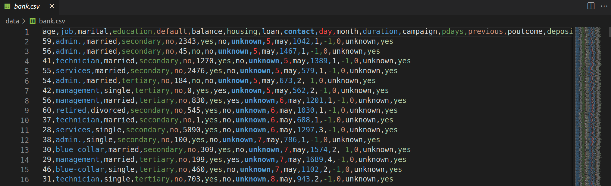

# Data Formats

## JSON

**JSON** (*JavaScript Object Notation*) is an open standard and language-independent file format that uses human-readable text to store and transmit data objects consisting of attribute–value pairs and arrays. For example:

```json
[
    {
        "age": 42,
        "job": "entrepreneur",
        "marital": "married",
        "education": "primary",
        "balance": 558,
        "housing": "yes",
        "duration": 186,
        "campaign": 2
    },
    {
        "age": 35,
        "job": "teacher",
        "marital": "single",
        "education": "master's",
        "balance": 1200,
        "housing": "no",
        "duration": 95,
        "campaign": 1
    },
    {
        "age": 28,
        "job": "engineer",
        "marital": "single",
        "education": "bachelor's",
        "balance": 3000,
        "housing": "yes",
        "duration": 240,
        "campaign": 3
    }
]
```

## CSV

**CSV** (*comma*-separated values) and TSV (*tab*-separated values) files are common types of plain text data files that are used to store **tabular data**. They provide a simple, lightweight and human readable format for exporting data.

The data in **CSV** and **TSV** files is organized into records or rows that are separated by newline characters. Each row contains one or more fields or values that are separated by delimiter characters.



Many programming languages and software tools (like *pandas*) provide functionality for easily reading and writing CSV and TSV files for routine data import/export tasks without the complexity of a full database.

!!! tip "Tip!"
    To Highlight **CSV** and **TSV** files in *VS Code*, install the [**Rainbow CSV**](https://marketplace.visualstudio.com/items?itemName=mechatroner.rainbow-csv) extension!

While **CSV** is a commonly used data format, it may have some disadvantages when used in machine learning scenarios:

- **Lack of Standardized Schema**: CSV files do not have a standardized schema definition. Each CSV file represents data as rows and columns, but the interpretation of the columns and their data types is left to the user or application. Without a standardized schema, it becomes the responsibility of the Data Scientist to define and enforce the schema, which can lead to inconsistencies and data quality issues.

- **Limited Data Type Support**: CSV only supports a few basic data types, such as strings and numbers. More complex data types commonly used in ML, such as datetime, categorical variables, or nested structures, require additional processing and transformation to fit into the CSV format. This can increase the complexity of data preprocessing and introduce potential errors or loss of information during conversion.

- **Lack of Data Compression**: CSV files do not provide built-in data compression. As a result, they can occupy a lot of disk space.

!!! Exercise text short "Question"

    In ML, where large datasets are common, give some examples where increased storage requirements can become a concern.
    
    !!! answer "Answer"
        Big data or distributed systems.

- **String Encoding Issues**: CSV files can encounter encoding issues, especially when dealing with non-ASCII characters or different encoding standards. Proper handling of string encoding is necessary to ensure data integrity in ML workflows.

- **Limited Support for Missing or Null Values**: CSV does not have a standardized representation for missing or null values. Different applications or tools may handle missing values differently, leading to inconsistencies in data interpretation.

- **Performance Overhead**: CSV files can have performance overhead, especially when dealing with large datasets. Parsing and processing CSV files can be slower compared to more optimized binary formats specifically designed for ML, such as Parquet or HDF5. The textual representation and parsing of CSV files can impact data loading and processing times, particularly in scenarios involving real-time or high-throughput ML.

- **Lack of Metadata Support**: CSV format does not provide native support for metadata. In ML, metadata such as feature descriptions, data provenance, or annotations can be crucial for understanding and interpreting the data.

## Parquet

[Parquet](https://parquet.apache.org/docs/file-format/) files are a **columnar storage** file format designed for efficient data storage and processing in big data and machine learning applications. Unlike row-based formats like **CSV** or **JSON**, Parquet organizes data column-wise, allowing for *better compression*, *faster query execution*, and *improved performance*.


This columnar storage format reduces disk I/O and memory footprint by reading only the necessary columns during ML model training or data analysis. Additionally, Parquet supports *predicate pushdown*, which means filtering operations can be pushed down to the storage layer, minimizing the amount of data that needs to be read.

Parquet files are particularly relevant in ML because of their ability to handle *large datasets* efficiently. ML models often require massive amounts of data for training, and Parquet's compression and query optimization capabilities can significantly reduce storage costs, improve processing speed, accelerate model training, and enhance overall performance.

!!! attention "To notice!"
    Parquet is valuable format in the ML ecosystem. Click [*Here*](https://github.com/tirthajyoti/Machine-Learning-with-Python/blob/master/Pandas%20and%20Numpy/Read_data_various_sources/Pandas%20CSV%20vs.%20PyArrow%20parquet%20reading%20speed.ipynb) to see a Pandas CSV vs. PyArrow parquet reading speed performance comparison.

!!! tip "Tip!"
    To explore Parquet files, you can Install [**Microsoft Data Wrangler**](https://marketplace.visualstudio.com/items?itemName=ms-toolsai.datawrangler) extension!


## Extra: protobuf

!!! info "A word from protobuf developers!"
    Protocol Buffers are a language-neutral, platform-neutral extensible mechanism for serializing structured data. It’s like JSON, except it’s smaller and faster

Although protobuf is mainly used for communication between services and defining APIs in systems that need high performance, it is an interesting read, especially since we talked about JSON in this class.

Some links about **Protocol Buffers**:

- https://protobuf.dev/
- https://protobuf.dev/getting-started/pythontutorial/
- https://lab.wallarm.com/what/protobuf-vs-json/
- https://auth0.com/blog/beating-json-performance-with-protobuf/
- https://buf.build/blog/the-real-reason-to-use-protobuf


## Exercises

In this exercise section, we will compare reading different file formats using `pandas`.

!!! exercise "Question"
    Create a folder to store the files for the next exercises.

!!! exercise "Question"
    Download the following data files:

    - https://mlops-material.s3.us-east-2.amazonaws.com/data_formats/ex_data.csv
    - https://mlops-material.s3.us-east-2.amazonaws.com/data_formats/ex_data.json
    - https://mlops-material.s3.us-east-2.amazonaws.com/data_formats/ex_data.parquet
    
    <div class="termy">

    ```console
    $ wget https://mlops-material.s3.us-east-2.amazonaws.com/data_formats/ex_data.csv
    $ wget https://mlops-material.s3.us-east-2.amazonaws.com/data_formats/ex_data.json
    $ wget https://mlops-material.s3.us-east-2.amazonaws.com/data_formats/ex_data.parquet
    ```

    </div>

!!! info "Info!"
    Understanding the contents of the files is not important for this activity. But feel free to explore if you want!

!!! exercise "Question"
    Consider the file `ex_data.json`. Use `pandas` to read it into a DataFrame.

    Repeat the procedure `1000` times, storing in a list the time used for each reading.

    !!! answer "Answer"

        ```python
        import pandas as pd

        import time

        read_times_json = []
        for i in range(1000):
            start_time = time.time()
            df2 = pd.read_json("ex_data2.json")
            end_time = time.time()
            read_times_json.append(end_time - start_time)
        ```

!!! exercise "Question"
    Repeat the previous exercise, now for the files `ex_data.csv` and `ex_data.parquet`.

    At the end, you should have three lists with the times for each format.

    !!! answer "Answer"

        **CSV**:

        ```python
        import pandas as pd

        import time

        read_times_csv = []
        for i in range(1000):
            start_time = time.time()
            df2 = pd.read_csv("ex_data2.csv")
            end_time = time.time()
            read_times_csv.append(end_time - start_time)
        ```

        **Parquet**:


        ```python
        import pandas as pd

        import time

        read_times_parquet = []
        for i in range(1000):
            start_time = time.time()
            df2 = pd.read_parquet("ex_data2.parquet")
            end_time = time.time()
            read_times_parquet.append(end_time - start_time)
        ```

!!! exercise "Question"
    Create a DataFrame with three columns, where each column has the reading times for each format.

    Then, calculate the descriptive statistics for each column of the DataFrame.

    !!! answer "Answer"

        ```python
        df_times = pd.DataFrame(
            {
                "json": read_times_json,
                "csv": read_times_csv,
                "parquet": read_times_parquet,
            }
        )

        df_times.describe()
        ```

!!! exercise "Question"
    Use `plotly express` to plot three boxplots, comparing the times of the formats.

    !!! answer "Answer"

        **Install:**

        <div class="termy">

        ```console
        $ pip install plotly.express nbformat
        ```

        </div>
        <br>
        **Python code:**

        ```python
        import plotly.express as px

        fig = px.box(df_times, y=df_times.columns, title="Boxplot of Read Times")
        fig.update_layout(xaxis_title="Data Formats", yaxis_title="Time")
        fig.show()
        ```

!!! exercise text long "Question"
    What are your conclusions?

!!! info "Important!"
    We used **pandas** to perform this test. If other libraries (such as **Spark**) are considered, it is expected that the use of `parquet` will be even more beneficial.
    
    For example, when performing **column and row filters**, **pandas** generally needs to **read the entire file** into memory first before it can apply the filter.

    On the other hand, **Apache Spark** does not need to read the entire `parquet` file to filter by a column, thanks to its ability to perform predicate pushdown and the efficient structure of the `parquet` format.

!!! exercise text long "Question"
    What **predicate pushdown** means?!

    !!! answer "Answer"
        Read [Here](./#parquet:~:text=Additionally%2C%20Parquet%20supports-,predicate%20pushdown,-%2C%20which%20means%20filtering).

        When you run a query that includes a filter (predicate), predicate pushdown attempts to "push" the filter as close as possible to the data source, so that the filtering is done as early as possible in the data processing pipeline. This reduces the amount of data that is read, processed, and transferred between different stages of the system.

## References

- Introduction to MLOps. Chapter 6.
- Designing Machine Learning Systems. Chapter 7.
- https://parquet.apache.org/docs/file-format/
- https://en.wikipedia.org/wiki/JSON
- POE