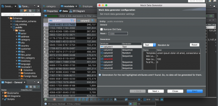
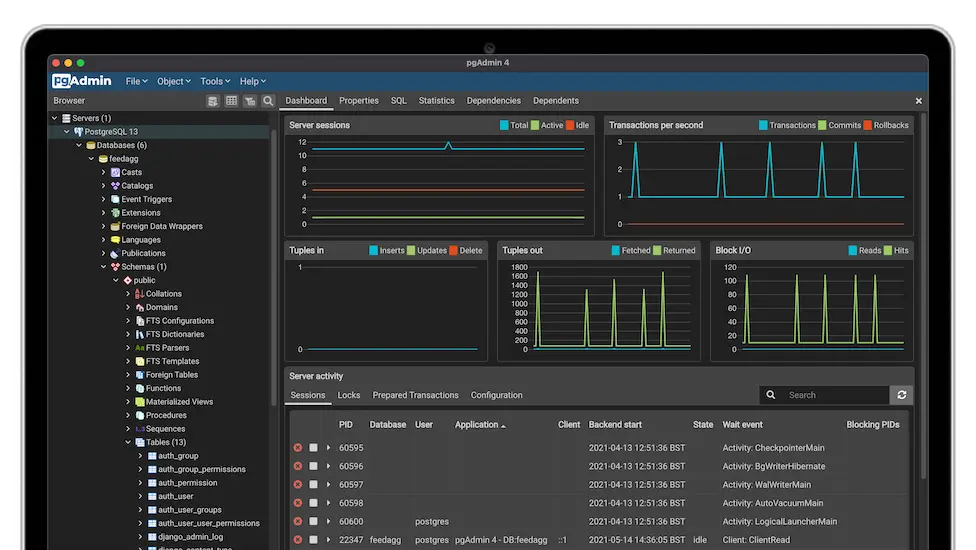

# Database tool

## Install

**pgAdmin** and **DBeaver** are two popular open-source database administration and management tools for working with SQL databases like PostgreSQL. It is enough to install only one of them.

!!! atention 
    These are the software recommended by the professor, but you can install or use another one that you already know.

- [*DBeaver - Click to Download!*](https://dbeaver.io/download/)

- [*pgAdmin - Click to Download!*](https://www.pgadmin.org/download/)

## Create connection

After installing, create a connection to the database.

!!! info
    **Credentials** are available on Blackboard!

## Schema

Check the `sales` schema. It contains an `item_sale` table with the lines like the ones contained in the *CSV* that served as input in our activity from the last class.