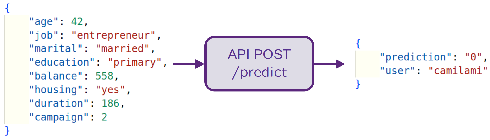
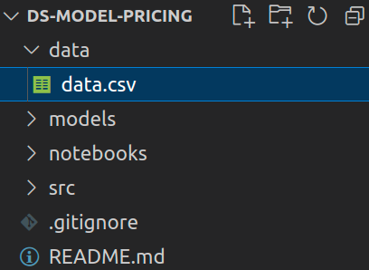

# Batch Prediction

## Remembering **Online** prediction

In the last class, we saw how to deploy a model using RESTful APIs.

!!! exercise choice "Question"
    Select the sentence that best explains when to use of *online deployment*.

    - [ ] For asynchronous workflows where the model takes a long time to generate each prediction
    - [ ] When predictions are needed hours, days or years from now.
    - [X] If you need instant or real-time prediction
    - [ ] It doesn't matter the way you deploy!

    !!! answer "Answer"
        **Online** prediction is when predictions are generated and returned as soon as *requests* for these predictions are received by the service. We usually do it because this instant or real-time prediction is needed!

        

        Some examples where it could be usefull:

        - Making time-critical predictions like detecting fraud moments after a transaction occurs
        - Provide real-time recommendations: movies, ads, products
        - Run sentiment analysis during chatbot conversations.

In the next classes, we will revisit this category of model deployment (**online**), making it more robust. For now, let's look at the **batch prediction** category!

## What is batch prediction?

In this deployment category, the trained model is applied to previously collected, static datasets stored in files or databases, rather than real-time streaming data.

!!! info
    The predictions are generated **periodically** or whenever **triggered**.
    
    We will deal with scheduling in the next classes.

Batch prediction is suitable for **non-real time predictive tasks** like:

- Price forecasting
- Customer churn
- Store assortment

where results *aren't needed instantly*.

!!! danger "Planning!"
    Note that the deployment category to be used depends a lot on how the model will be used.
    
    For example, a pricing model could either need **batch** predictions (suppose the price will be printed on a flyer) or real-time **online** (if the price changes a lot and will be used on a website, varying according to customer behavior).

    Whenever possible, align this clearly with the customer at the planning stage of the model lifecycle!

## Doing batch prediction

In the first class, when we saw how to standardize a data science project, there were specific folders for data storage, notebooks and source code.

!!! exercise short "Question"
    Would the `data.csv` file be used during training? How would you deal with data?

    !!! answer "Answer"
        If the model doensn't exists, we need data to train it! So, probably yes!

!!! exercise short "Question"
    During the phase of model construction, would this `data.csv` file change? Explain it.

    !!! answer "Answer"
        You may find that the data is not enough in volume or that you need new features to achieve the design goals.

        Assuming enough data, it would be transformed (feature engineering, feature selection) but would remain the same during training in the phase of model construction.

!!! exercise long "Question"
    After model deployment:

    - Will the model need to be retrained?
    - Will it be retrained in the same data?

    Explain yourself!

    !!! answer "Answer"
        Yes for the first, no for the second!

        It will be necessary to retrain if the model lose performance over time (it almost certainly will).

        We'll deal with retraining in the next classes, but it's important to start thinking about it!

!!! exercise long "Question"
    What about when we deploy the model and need to predict with it?
    
    Assuming that the model reads a batch of data from a file, would it be the same file used for training?

    Justify your answer.

    !!! answer "Answer"
        Absolutely not! In the first class we did this for simplicity. We would like to make predictions on new data.

!!! exercise long "Question"
    Still on prediction in new data: assuming that the model **reads a batch of data** from a file called `predict.csv`, would this file remain the same (have the same records) every time the predict script is called?

    Justify your answer.

    !!! answer "Answer"
        No. Assuming that the whole file has been predicted, the next time that the prediction script is called, we would like to indicate a new file or that the `predict.csv` file has new data.

So, in order to do batch prediction, we need to worry about **getting data**!

So let's talk about **data formats** and **data sources**. Advance to the next topic!