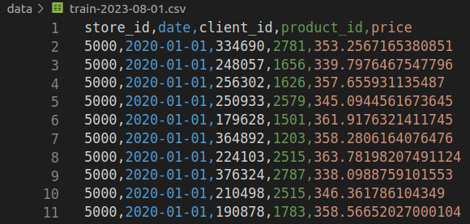

# Practicing

## Create folder

Use cookiecutter and your template, created in [**class 01**](../01-intro/aps01_part_2.md#task-01-create-a-template), to create a new folder/project for today's class. You can use any name for the folder/project (I chose `p03-batch`).

!!! danger "Atention"
    If you didn't do this part of the activity (APS 01 part 2) and do not have a template, create the folders manually.

<div class="termy">

    ```console
    $ cookiecutter https://github.com/macielcalebe/template-ds-maciel.git --checkout main
    You've downloaded /home/calebe/.cookiecutters/template-ds-maciel before. Is it okay to delete and re-download it? [y/n] (y): y
    [1/3] directory_name (project-name): p03-batch
    [2/3] author_name (Your Name): Maciel
    [3/3] compatible_python_versions (^3.8):
    ```

</div>

<br>
Let's check if the folders were created correctly.

<div class="termy">

    ```console
    $ cd p03-batch/
    $ ls
    data  models  notebooks  README.md  src
    ```

</div>

<br>
!!! info "Important"
    This is not a repository (yet). We just created the folders structure of a ML project!

## Introduction

In this task, we are going to create a model for forecasting sales for five stores of a company. The model will make predictions in batch, for now called manually from terminal.

## Task 1: Generating *Train* data

??? "Click Here to see a script that generates data!"
    Copy this python script to the path `src/get_data.py`
    ```python
    import sys
    import os
    import numpy as np
    import random
    import datetime
    import calendar
    import pandas as pd
    import itertools


    class Config:
        stores = {
            5000: {
                "avg_n": 100,
                "avg_price": 350.0,
                "std": 10.0,
                "boost_weekday": [6, 7],
                "boost_months": [5, 12],
            },
            5001: {
                "avg_n": 10,
                "avg_price": 500.0,
                "std": 20.0,
                "boost_weekday": [7],
                "boost_months": [5, 12],
            },
            5002: {
                "avg_n": 25,
                "avg_price": 400.0,
                "std": 10.0,
                "boost_weekday": [7],
                "boost_months": [4, 10, 12],
            },
            5003: {
                "avg_n": 200,
                "avg_price": 220.0,
                "std": 12.0,
                "boost_weekday": [1, 3, 7],
                "boost_months": [],
            },
            5004: {
                "avg_n": 140,
                "avg_price": 415.0,
                "std": 17.0,
                "boost_weekday": [4, 6, 7],
                "boost_months": [4, 10, 12],
            },
            5005: {
                "avg_n": 50,
                "avg_price": 890.0,
                "std": 15.0,
                "boost_weekday": [6, 7],
                "boost_months": [5, 12],
            },
        }
        product_ids = np.random.randint(1000, 3000, size=30)


    def generate_day_sales(store_id, date):
        config = Config.stores[store_id]
        year, month, day = date.year, date.month, date.day
        n_sales = np.random.poisson(lam=config["avg_n"])

        if date.weekday() in config["boost_weekday"]:
            n_sales = int(n_sales * random.uniform(1.6, 1.7))

        if month in config["boost_months"]:
            n_sales = int(n_sales * random.uniform(1.45, 1.50))

        stores = np.full(n_sales, store_id)
        products = np.random.choice(Config.product_ids, size=n_sales)
        prices = np.random.normal(
            loc=config["avg_price"], scale=config["std"], size=n_sales
        )
        dates = np.full(n_sales, date.strftime("%Y-%m-%d"))
        client_ids = np.random.randint(100000, 400000, size=n_sales)

        return pd.DataFrame(
            {
                "store_id": stores,
                "date": dates,
                "client_id": client_ids,
                "product_id": products,
                "price": prices,
            }
        )


    def generate_predict_register(store_id, date):
        return pd.DataFrame(
            {
                "store_id": [store_id],
                "year": [date.year],
                "month": [date.month],
                "day": [date.day],
                "weekday": [date.weekday()],
            }
        )


    def generate_data(year_from, month_from, day_from, year_to, month_to, day_to, type_):
        dates = pd.date_range(
            start=f"{year_from}-{month_from:02d}-{day_from:02d}",
            end=f"{year_to}-{month_to:02d}-{day_to:02d}",
        )
        store_ids = list(Config.stores.keys())
        combinations = itertools.product(store_ids, dates)

        dfs = []
        for store_id, date in combinations:
            if type_ == "train":
                dfs.append(generate_day_sales(store_id, date))
            else:
                dfs.append(generate_predict_register(store_id, date))

        return pd.concat(dfs, ignore_index=True)


    if __name__ == "__main__":
        print("Simulate data ingestion!")

        out_type = sys.argv[-1]

        if len(sys.argv) != 8 or out_type not in ["train", "predict"]:
            print("USAGE: python get_data.py <year_from> <month_from> <day_from> <year_to> <month_to> <day_to> <train/predict>")
        else:
            date_args = sys.argv[1:-1]
            date_args = [int(x) for x in date_args]
            df = generate_data(*date_args, out_type)
            st_date = "-".join(sys.argv[4:-1])
            if out_type == "train":
                file_name = f"{out_type}-{st_date}.csv"
            else:
                file_name = f"{out_type}-{st_date}.parquet"

            file_path = os.path.join("../data/", file_name)
            print(f"Saving to {file_path} file...")

            if out_type == "train":
                df.to_csv(file_path, index=False)
            else:
                df.to_parquet(file_path.replace(".csv", ".parquet"), index=False)
    ```

Let's use this script to simulate ingesting data that will be used whenever the model needs it:

- be trained
- make prediction

!!! exercise "Question"
    Copy the script source code and place it in file path `src/get_data.py`.

<div class="termy">

    ```console
    $ python3 get_data.py help
    Simulate data ingestion!
    USAGE: python get_data.py <year_from> <month_from> <day_from> <year_to> <month_to> <day_to> <train/predict>
    ```

</div>

<br>
We will consider as training data from the beginning of the year 2022 until the first day of August 2023.

<div class="termy">

    ```console
    $ python3 get_data.py 2022 01 01 2023 08 01 train
    Simulate data ingestion!
    Saving to ../data/train-2023-08-01.csv file...
    ```

</div>

<br>

This will create a `train-2023-08-01.csv` file in the `data` folder containing the sales data for each company's store.

Each line in this file represents a sale made to a customer.



## Task 2: Processing train file

The model will predict the total to be sold **per store** in one day.

So we need to process the input data to change its granularity. The expected result is a DataFrame where each line represents the total sales of a store in one day:

|      |   store_id |   total_sales |   year |   month |   day |   weekday |
|-----:|-----------:|--------------:|-------:|--------:|------:|----------:|
|    0 |       5000 |      62895.6  |   2023 |       1 |     1 |         6 |
|    1 |       5000 |      42351.1  |   2023 |       1 |     2 |         0 |
|    2 |       5000 |      37377.4  |   2023 |       1 |     3 |         1 |
|    3 |       5000 |      31385.5  |   2023 |       1 |     4 |         2 |
...
| 1636 |       5005 |      46246.3  |   2023 |       9 |    29 |         4 |
| 1637 |       5005 |      43698.2  |   2023 |       9 |    30 |         5 |

Notice the feature `weekday`. It represents the day of the week, going from `0` to `6`.

!!! exercise choice "Question"
    Which of the variables is our target variable?

    - [ ] store_id
    - [X] total_sales
    - [ ] year
    - [ ] month
    - [ ] day
    - [ ] weekday


    !!! answer "Answer"
        **total_sales**, that's what we are predicting!

!!! exercise "Question"
    Construct a python script that does the required granularity change and adds the `weekday` feature.

    Save the result using in folder `../data` (relative to `src`) using **parquet** file format.

## Task 3: Trainning the model

Train a model using `RandomForestRegressor` or any other of your preference.

```python
from sklearn.ensemble import RandomForestRegressor

model = RandomForestRegressor(n_estimators=100, random_state=195)
model.fit(X_train, y_train)
```

!!! exercise "Question"
    Construct a python script `src/train.py` that receives as argument the path of preprocessed training file:

    <div class="termy">

    ```console
    $ python3 train.py ../data/train-2023-08-01.parquet
    Training model!
    Saving to ../model/model-2023-08-01.pickle file...
    ```

</div>

## Task 4: Simulate predicton data

Now that the model is trained, we can use it to make predictions on future dates, having an estimate of the billing provided by each store.

Let's use our script to simulate ingesting the data for predict. You can imagine that some system task would generate a file containing the batch of data that must be used by the model to make predictions. The script will simulate this task.

Then, when it was time for the model to make predictions, the model would read the lines from this file and generate predictions of total sales.

!!! exercise "Question"
    Call the python script `src/get_data.py` in order to generate prediction data:

    <div class="termy">

    ```console
    $ python3 get_data.py 2023 08 02 2023 08 03 predict
    Simulate data ingestion!
    Saving to ../data/predict-2023-08-03.parquet file...
    ```

    </div>

<br>
As the prediction is performed by store and by day, each line of this file will contain a store x day combination:

|    |   store_id |   year |   month |   day |   weekday |
|---:|-----------:|-------:|--------:|------:|----------:|
|  0 |       5000 |   2023 |       8 |     2 |         2 |
|  0 |       5000 |   2023 |       8 |     3 |         3 |
|  0 |       5001 |   2023 |       8 |     2 |         2 |
|  0 |       5001 |   2023 |       8 |     3 |         3 |
|  0 |       5002 |   2023 |       8 |     2 |         2 |
|  0 |       5002 |   2023 |       8 |     3 |         3 |
|  0 |       5003 |   2023 |       8 |     2 |         2 |
|  0 |       5003 |   2023 |       8 |     3 |         3 |
|  0 |       5004 |   2023 |       8 |     2 |         2 |
|  0 |       5004 |   2023 |       8 |     3 |         3 |
|  0 |       5005 |   2023 |       8 |     2 |         2 |
|  0 |       5005 |   2023 |       8 |     3 |         3 |

## Task 5: Making predictions

!!! exercise "Question"
    Construct a python script `src/predict.py` which takes two arguments (model and file with data for predict), then:

    - Reads a model from `../model`
    - Make predictions for each row of argument file
    - Save predictions to a new file

    <div class="termy">

    ```console
    $ python3 predict.py ../model/model-2023-08-01.pickle ../data/predict-2023-08-03.parquet
    Making predictions!
    Saving to ../data/predict-done-2023-08-03.parquet file...
    ```

    </div>

<br>

Done! Whenever there is a new file that must be predicted, just call the `predict.py` script, informing which model to be used and the path of the file with the data! Then, the model will read this batch of information and perform the prediction.

## Extra questions!

### Categorical variables

!!! exercise text long "Question"
    Are there categorical variables in the training data? If yes, which ones?

    Should we use OneHotEncoder? Explain.

!!! exercise "Question"
    Create scenarios and python code to evaluate the previous question.

### OOT validation

How do we check if a model is good? Although for now we haven't focused much on the construction details of the models, this is an important topic worth discussing!

!!! info
    We say that a model is good if it is performing well in **unseen data**.

It is common to use `train_test_split` to generate `X_test` and `y_test`. This is the **Out-of-sample** (**OOS**) validation, where data are split in a random way.

**Out-of-time** (**OOT**) refers to evaluating the performance of a trained model on data that falls **outside the time period** or timeframe used for training the model. This concept is particularly relevant in scenarios where the data is **time-dependent** or exhibits **temporal** patterns (like).

!!! example "OOT Example!"
    If your training data are from january to july, use data from January to May for training and separate June and July to check model performance!

!!! tip "Tip!"
    Once you decide the model is good enough, you can retrain with the whole base (January to July) and deploy this new version of the model!

!!! exercise text long "Question"
    Explain when is it a good idea to use OOT and what would be the consequences if you don't!