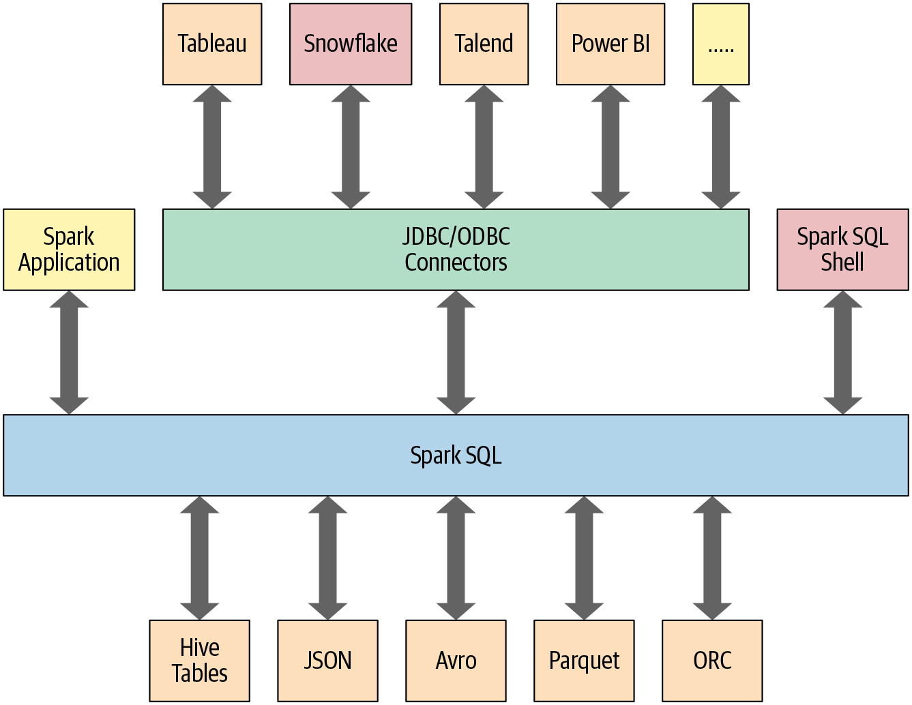

# SQL

Machine learning models can take *input data* directly from a *SQL database* like [PostgreSQL](https://www.postgresql.org/).

Some reasons for that:

- SQL databases are commonly used for storing large volumes of **structured data** that models can be trained and scored on. Integrating with SQL allows models to leverage *existing data infrastructure*.

- Models can *query only the new/updated rows* as needed rather than processing all the data each time.

- SQL databases allow joining model *input features from multiple related tables* as needed. This can help models make better predictions by incorporating more context.

- *Storing predictions* back in SQL allows those results to then be queried, analyzed, and accessed by other downstream applications and processes.

- Analytics engine for large-scale data processing, like Apache *Spark*, have a *SQL API*.

