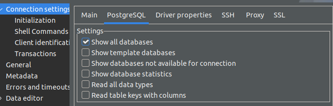

# Docker

Docker is the most well-known containerization technology and has become the de facto standard.

We are going to use Docker because at some point we will have several services interconnected to provide ML services.

## Install
If you don't have [Docker](
https://docs.docker.com/get-docker/) installed, go to [this link](
https://docs.docker.com/get-docker/) and install it.

## Start a service

Let's get a PostgreSQL database service up. First, let's do it via the command line:

<div class="termy">

    ```console
    $ docker run -d --name postgres-mlops -p 5100:5432 -e POSTGRES_PASSWORD=abc123 -v pg-data:/var/lib/postgresql/data postgres
    ```

</div>

## DB Connection

Open DBeaver and create a database connection. Use as credentials:

```
HOST: "localhost"
USERNAME: "postgres"
PASSWORD: "abc123"
DB: "postgres"
PORT: 5100
```
!!! tip "Tip!"
    When creating the connection, on the second tab check the option "*Show all databases*"

    Thus, if you create new databases, they will be displayed automatically.

    

## DDL - Data Definition Language

Create the database used in the previous class. Here is the DDL from the `item_sale` table:

!!! danger "Important!"
    If the schemas and tables were created correctly, this change is a mere deploy information.

```sql
CREATE SCHEMA IF NOT EXISTS sales;
CREATE SCHEMA IF NOT EXISTS sales_analytics;

DROP TABLE IF EXISTS sales.item_sale;
CREATE TABLE sales.item_sale (
  id SERIAL PRIMARY KEY,
  store_id integer,
  client_id integer,
  product_id integer,
  date_sale DATE,
  price decimal(10,2)
);


DROP INDEX IF EXISTS item_sale_store_id_idx;
CREATE INDEX IF NOT EXISTS item_sale_store_id_idx ON sales.item_sale (store_id,date_sale);
```

Inserts in this table can be done with:

```sql
INSERT INTO sales.item_sale
    (store_id, client_id, product_id, date_sale, price)
VALUES
    (5000, 148331, 1715, '2022-01-01', 362.16),
    (5000, 203423, 1921, '2022-01-01', 334.23),
    (5000, 192737, 1667, '2022-01-01', 351.77),
    (5005, 369515, 2131, '2023-08-22', 877.95);
```

!!! exercise "Question"
    Change the [project](../03-batch/aps02_sql.md) from the [previous class](../03-batch/aps02_sql.md) to use your PostgreSQL service running on Docker (replacing the server provided by the professor).

!!! exercise "Question"
    Also, execute (in the PostgreSQL Docker) the **DDL**  to create other views and tables that you used.

!!! danger "Attention!"
    If the schemas and tables were created correctly, this change is a mere deploy information.
    
    So, we will have changes in the `.env` and **nothing in the code**!