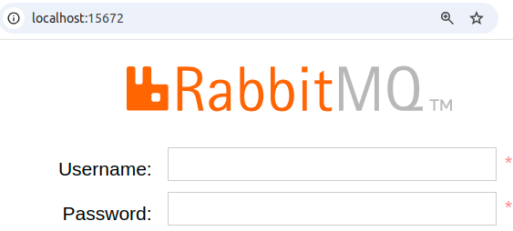
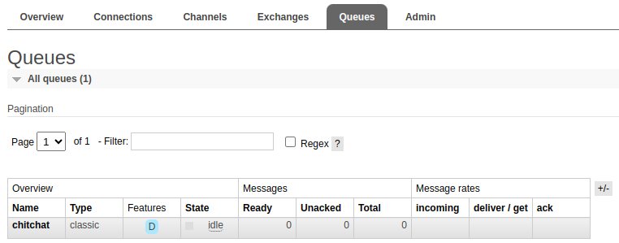

# RabbitMQ

## What is RabbitMQ?

RabbitMQ is a popular open-source message broker that simplifies **messaging** between distributed systems via *AMQP* (Advanced Message Queuing Protocol) and other protocols in a scalable and reliable manner.

## Tutorial

Let's practice and learn how to use RabbitMQ! We will implement the **producer-consumer** model (seen in the Sistemas-Hardware-Software course).


In this model, one or more applications will produce messages, which must be processed asynchronously by one or more consumer applications.

!!! info "Info!"
    The management and delivery of messages will be done by RabbitMQ!

### Creating the producer

Our application will be very simple: the user will type any text. We will use RabbitMQ to ensure that this message is received by another consuming application.

Let's start with the producer!

!!! tip "Tip!"
    Create a new folder and store all the activities in this tutorial in it!

!!! exercise "Question"
    Create a python application that asks the user to enter a message in the terminal.
    
    Repeat until the user types `"exit"`.

!!! info "Info!"
    For now, forget about RabbitMQ, just make sure you can read messages typed by the user.

??? Answer
    ```python
    while True:
        msg = input("Type a message: ")

        if msg == "exit":
            break
    ```

### Instantiate RabbitMQ

#### Create `docker-compose.yml`

Let's start a RabbitMQ service using Docker.

Let's create a `docker-compose.yml` file with the following content:

```yaml
services:
  rabbitmq:
    image: rabbitmq:3-management
    container_name: rabbitmq
    restart: always
    ports:
      - 5672:5672
      - 15672:15672
    volumes:
      - ./rabbitmq:/var/lib/rabbitmq
    environment:
      - RABBITMQ_DEFAULT_USER=admin
      - RABBITMQ_DEFAULT_PASS=112233
```
!!! tip "Tip!"
    Docker Compose allows defining and running multiple Docker containers using a Compose file that describes the whole application. It makes it easy to collaborate on multi-container apps.

    For now our application will only contain RabbitMQ, but it costs nothing to practice!

!!! exercise text long "Question"
    Explain what this section means:

    ```yaml
    ports:
      - 5672:5672
      - 15672:15672
    ```

    !!! answer "Answer!"
        The ports section maps the container's ports to the host's ports:

        - `5672:5672`: This maps port `5672` of the RabbitMQ container to port `5672` on the host machine. Port `5672` is the default port for **AMQP** (*Advanced Message Queuing Protocol*), which is used for messaging by RabbitMQ.

        - `15672:15672`: This maps port `15672` of the RabbitMQ container to port `15672` on the host machine. Port `15672` is the default port for the **RabbitMQ Management Plugin**, which provides a web-based user interface for managing RabbitMQ.

!!! exercise "Question"
    Create your `docker-compose.yml`, change the ports or password if needed.

#### Start RabbitMQ

!!! exercise "Question"
    Start RabbitMQ by using:

    <div class="termy">

    ```console
    $ docker compose build
    $ docker compose up
    ```

    </div>

!!! exercise "Question"
    Then, go to **http://localhost:15672/** to access the RabbitMQ Web admin.

    !!! info "Info!"
        Change the port if you have made any changes to docker compose.

    !!! answer "Answer!"
        You should see a page similar to:

        

!!! tip "Tip!"
    Use the **username** and **password** configured in docker compose.

!!! exercise "Question"
    Make sure you can log in!

### Send messages to Queue

Let's use the `pika` client to communicate between our Python application and Rabbitmq. Install it with:

!!! tip "Tip!"
    It's a good idea to do this in a virtual environment!

<div class="termy">

    ```console
    $ python -m pip install pika --upgrade
    ```

</div>
<br>

So let's create a `producer.py` code so that it does the sending of messages to the queue.

!!! exercise "Question"
    Create an `.env` file containing the `RABBIT_USERNAME` and `RABBIT_PASSWORD` variables.

This will be the `producer.py`:

```python
import pika
import os
from dotenv import load_dotenv

load_dotenv()

# Configure credentials
credentials = pika.PlainCredentials(
    os.getenv("RABBIT_USERNAME"), os.getenv("RABBIT_PASSWORD")
)

# Create a connection
connection = pika.BlockingConnection(
    pika.ConnectionParameters("localhost", credentials=credentials, heartbeat=0)
)

channel = connection.channel()

# Create a queue named "chitchat"
channel.queue_declare(queue="chitchat", durable=True)

while True:
    msg = input("Type a message: ")

    if msg == "exit":
        # Close connection
        connection.close()
        break

    # Send a message to queue
    channel.basic_publish(
        exchange="",
        routing_key="chitchat",
        body=msg,
    )
```
!!! exercise "Question"
    Run the code, but before sending the first message, access the RabbitMQ Administration Dashboard under the **Queue** tab. Check if the `chitchat` queue has been created.

    

!!! danger "Atention"
    If you don't understand something, ask the professor for help!

!!! exercise "Question"
    Type some messages into the `producer.py` terminal.

    Check in the RabbitMQ Dashboard if they are being sent to the queue.

    

    The *"Ready"* counter should increment with each new message.

### Consume messages

Now let's program the consumer!

!!! exercise "Question"
    Create a `consumer.py` file.

This will be the content of `consumer.py`:

```python
import pika
import os
from dotenv import load_dotenv

load_dotenv()


# Define callback function (consumer function)
def callback(ch, method, properties, body):
    print(f"Received: {body}")
    # Notify RabbitMQ that message was processed
    ch.basic_ack(method.delivery_tag)


# Configure credentials
credentials = pika.PlainCredentials(
    os.getenv("RABBIT_USERNAME"), os.getenv("RABBIT_PASSWORD")
)

# Create a connection
connection = pika.BlockingConnection(
    pika.ConnectionParameters("localhost", credentials=credentials, heartbeat=0)
)

channel = connection.channel()

# Declare a queue named "chitchat"
channel.queue_declare(queue="chitchat", durable=True)

# Configures which function should process the messages
channel.basic_consume(
    queue="chitchat",
    auto_ack=False,
    on_message_callback=callback,
)

print("Waiting for messages. To exit press CTRL+C...")

try:
    channel.start_consuming()
except KeyboardInterrupt:
    channel.stop_consuming()

connection.close()
```

!!! exercise "Question"
    Run `consumer.py` and check out:

    - If the messages were received (print on the consumer).
    - Whether the queue was emptied (Dashboard RabbitMQ).

!!! exercise "Question"
    Create multiple instances of `consumer.py` in multiple terminal windows.

    Send new messages through `producer.py` and check if they are processed by different consumers.

!!! exercise "Question"
    Change the `callback` function, adding a `10` second wait to simulate slow processing.

    Check whether, between receipt and completion of consumption, if the *unacked* message counter is incremented in the RabbitMQ Dashboard.

!!! exercise long "Question"
    Change the `callback` function to:
    ```python
    # Define callback function (consumer function)
    def callback(ch, method, properties, body):
        print(f"Processing: {body}")
        time.sleep(10)
        print(f"Done: {body}")
        # Notify that message was processed
        ch.basic_ack(method.delivery_tag)
    ```

    So that we can know, in the consumer, when the consumption of the message starts and when it ends.

    Start two consumers, send a message and check if it is correctly processed.

    Then, send a new message, however, before its processing is finished, press `CTRL+C` in the terminal, so that the consumer process receives an interruption signal and is finished.

    Explain what happens to the message that was being processed.

    !!! answer "Answer"
        Due to `auto_ack=False`, if the consumer dies before notifying that the message was correctly processed, then the message is automatically redistributed to other consumers (or waits in the queue if there are no free consumers).

!!! exercise long "Question"
    Can you think of some situations where the use of `auto_ack=True` is indicated?

## Challenge

Let's create a processing queue for our ML model used in the initial classes.

!!! info "Info!"
    This activity is not for delivery, you can save it in a folder on your machine.

!!! exercise "Question"
    Using as reference the version we deployed via API, create a RabbitMQ **producer** that creates random **JSON** like:

    ```JSON
    {
        "age": 42,
        "job": "entrepreneur",
        "marital": "married",
        "education": "primary",
        "balance": 558,
        "housing": "yes",
        "duration": 186,
        "campaign": 2
    }
    ```

    Then the **producer** must send the **JSON** to the **ML processing queue**.

    !!! info "Info!"
        Create a new ML processing queue with whatever name you want!

!!! exercise "Question"
    Now let's create the consumer.

    Using as a base the version in which we deployed via API, create a RabbitMQ `callback` function (the function may have another name) that receives a JSON in the `body`, like:

    ```JSON
    {
        "age": 42,
        "job": "entrepreneur",
        "marital": "married",
        "education": "primary",
        "balance": 558,
        "housing": "yes",
        "duration": 186,
        "campaign": 2
    }
    ```

    Then, makes the prediction and prints the predicted value on the screen. 

!!! exercise "Question"
    Test everything, ensuring that:

    - The producer sends messages to the queue.
    - The consumer predicts the messages stored in the queue.

Let's make a change! Suppose that the result predicted in the previous exercises needs to be used by another application.

!!! exercise "Question"
    Change your code so that the predict function (consumer) adds a new field with the predicted value in the JSON. Your application must add the JSON, with predicted value, into a second queue.

    !!! info "Info!"
        Use any name you like for this second queue!

!!! exercise "Question"
    Create a new consumer to empty this second queue. Just display the consumed messages on the screen!

## References
- https://icons.iconarchive.com/icons/martz90/circle/512/messages-icon.png
- https://static.vecteezy.com/system/resources/previews/023/404/794/original/3d-package-delivery-png.png
- POE
- https://www.rabbitmq.com/getstarted.html
