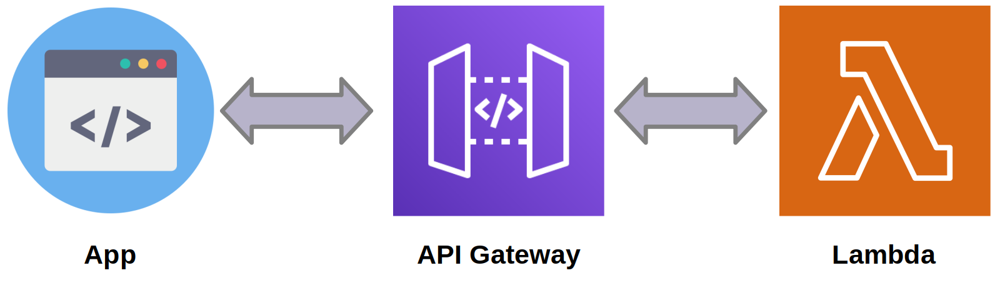

# API Gateway

## API

We will add an API service. Thus, every time there is a call to the API endpoint, whether through the browser or an application, the Lambda function will be triggered.

This will be the schematic drawing:



## Create API

!!! exercise "Question"
    Change API name (some new name) and function name (created on previous page).

```python
import boto3
import os
from dotenv import load_dotenv
import random
import string


load_dotenv()

lambda_function_name = "" # Example: sayHello_<INSPER_USERNAME>
api_gateway_name = "" # Example: api_hello_<INSPER_USERNAME>"

id_num = "".join(random.choices(string.digits, k=7))

api_gateway = boto3.client(
    "apigatewayv2",
    aws_access_key_id=os.getenv("AWS_ACCESS_KEY_ID"),
    aws_secret_access_key=os.getenv("AWS_SECRET_ACCESS_KEY"),
    region_name=os.getenv("AWS_REGION"),
)

lambda_function = boto3.client(
    "lambda",
    aws_access_key_id=os.getenv("AWS_ACCESS_KEY_ID"),
    aws_secret_access_key=os.getenv("AWS_SECRET_ACCESS_KEY"),
    region_name=os.getenv("AWS_REGION"),
)

lambda_function_get = lambda_function.get_function(FunctionName=lambda_function_name)

print(lambda_function_get)

api_gateway_create = api_gateway.create_api(
    Name=api_gateway_name,
    ProtocolType="HTTP",
    Version="1.0",
    RouteKey="ANY /", # Here you can change to GET POST and provide route like "GET /hello"
    Target=lambda_function_get["Configuration"]["FunctionArn"],
)

api_gateway_permissions = lambda_function.add_permission(
    FunctionName=lambda_function_name,
    StatementId="api-gateway-permission-statement-" + id_num,
    Action="lambda:InvokeFunction",
    Principal="apigateway.amazonaws.com",
)

print("API Endpoint:", api_gateway_create["ApiEndpoint"])
```

!!! exercise "Question"
    access the provided endpoint to check if the API works!

## Show APIs

To list the APIs registered in the account, use:

=== "Without pagination"
    ```python
    import boto3
    import os
    from dotenv import load_dotenv

    load_dotenv()

    api_gateway = boto3.client(
        "apigatewayv2",
        aws_access_key_id=os.getenv("AWS_ACCESS_KEY_ID"),
        aws_secret_access_key=os.getenv("AWS_SECRET_ACCESS_KEY"),
        region_name=os.getenv("AWS_REGION"),
    )

    response = api_gateway.get_apis(MaxResults="2000")

    # Show APIs name and endpoint
    print("APIs:")
    for api in response["Items"]:
        print(f"- {api['Name']} ({api['ApiEndpoint']})")
    ```

=== "With pagination"
    If you have many APIs, you may need to paginate through the results:
    ```python
    import boto3
    import os
    from dotenv import load_dotenv

    load_dotenv(override=True)

    api_gateway = boto3.client(
        "apigatewayv2",
        aws_access_key_id=os.getenv("AWS_ACCESS_KEY_ID"),
        aws_secret_access_key=os.getenv("AWS_SECRET_ACCESS_KEY"),
        region_name=os.getenv("AWS_REGION"),
    )

    apis = []
    next_token = None

    while True:
        if next_token:
            response = api_gateway.get_apis(MaxResults="100", NextToken=next_token)
        else:
            response = api_gateway.get_apis(MaxResults="100")

        apis.extend(response.get("Items", []))

        next_token = response.get("NextToken")
        if not next_token:
            break

    print(f"You have {len(apis)} APIs\n")

    # Show APIs name and endpoint
    if apis:
        print("APIs:")
        for api in apis:
            print(f"- {api['Name']} ({api['ApiEndpoint']})")
    ```

!!! exercise "Question"
    Make sure your **API** is on the list!

??? tip "Tip: How to delete an API"
    To delete an **API**, you can use the following code:

    !!! warning "Warning"
        More then one **API** with the same name may exist.

        APIs are identified by their unique IDs!

    ```python
    """Deletes the first REST API found with the specified name."""
    import boto3
    import os
    from dotenv import load_dotenv

    load_dotenv(override=True)

    # Provide the name of the API to delete. E.g., "api_hello_<YOUR_INSPER_USERNAME>"
    api_name = ""

    if not api_name:
        raise ValueError("No API name provided!")

    api_gateway = boto3.client(
        "apigateway",
        aws_access_key_id=os.getenv("AWS_ACCESS_KEY_ID"),
        aws_secret_access_key=os.getenv("AWS_SECRET_ACCESS_KEY"),
        region_name=os.getenv("AWS_REGION"),
    )

    # List all APIs with pagination
    apis = []
    position = None

    while True:
        if position:
            response = api_gateway.get_rest_apis(limit=100, position=position)
        else:
            response = api_gateway.get_rest_apis(limit=100)

        apis.extend(response.get("items", []))
        position = response.get("position")

        if not position:
            break

    # Find API by name
    target_api = next((api for api in apis if api["name"] == api_name), None)

    if not target_api:
        print(f"REST API with name '{api_name}' not found.")
    else:
        api_id = target_api["id"]
        try:
            api_gateway.delete_rest_api(restApiId=api_id)
            print(f"REST API '{api_name}' (ID: {api_id}) deleted successfully.")
        except Exception as e:
            print("Error while deleting REST API:", str(e))
    ```

## Practicing

!!! exercise "Question"
    To practice, you should create a lambda function that returns the number of words in a sentence.

    You must create a `POST /word-count` route that receives a phrase in the body of the request.