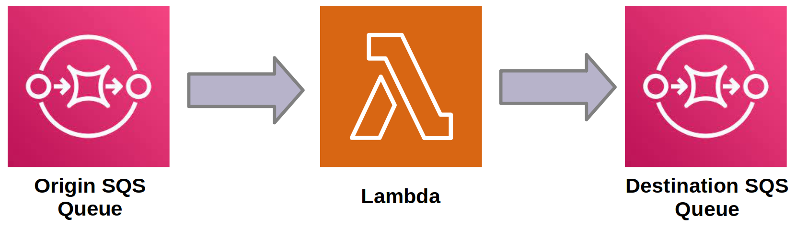

# SQS and Lambda

We will create a lambda function that is activated whenever new messages arrive in a queue.



The lambda function will receive a batch of messages and, after processing them, will send them to a new queue.

## A Lambda that Sends Messages

Let's start by creating a lambda function that can write to a queue (send messages):

```python
import boto3
import os


def lambda_handler(event, context):
    # Create an SQS client
    sqs = boto3.client("sqs")

    # Define the queue URL
    queue_url = os.environ.get("DESTINATION_SQS_URL")

    # Define the message to send
    message_body = "I can send messages to SQS!"

    # Send message to the queue
    response = sqs.send_message(QueueUrl=queue_url, MessageBody=message_body)
    return response
```


Notice that the *handler* sends a fixed message `"I can send messages to SQS!"`. Furthermore, the destination queue URL is in an environment variable.

!!! exercise "Question"
    Save this code to `lambda_send_sqs.py` and compress it to `lambda_send_sqs.zip`

!!! exercise "Question"
    Before creating the lambda function, create a queue `lambda_destination_queue_INSPER_USERNAME`

To create the lambda function, use:

!!! danger "Atention!"
    Change the:
    
    - `function_name` variable.
    - `DESTINATION_SQS_URL` to the SQS URL of the destination queue (`"lambda_destination_queue_INSPER_USERNAME"`).


```python
import os
import boto3
from dotenv import load_dotenv

load_dotenv()

# Lambda function name: send_sqs_<INSPER_USERNAME>
function_name = ""

environment_variables = {
    "DESTINATION_SQS_URL": "",
}

# Timeout in seconds. Default is 3.
timeout = 15
# Lambda basic execution role
lambda_role_arn = os.getenv("AWS_LAMBDA_ROLE_ARN")

# Create a Boto3 client for AWS Lambda
lambda_client = boto3.client(
    "lambda",
    aws_access_key_id=os.getenv("AWS_ACCESS_KEY_ID"),
    aws_secret_access_key=os.getenv("AWS_SECRET_ACCESS_KEY"),
    region_name=os.getenv("AWS_REGION"),
)

# Read the contents of the zip file that you want to deploy
with open("lambda_send_sqs.zip", "rb") as f:
    zip_to_deploy = f.read()

lambda_response = lambda_client.create_function(
    FunctionName=function_name,
    Runtime="python3.10",
    Role=lambda_role_arn,
    Handler="lambda_send_sqs.lambda_handler",
    Code={"ZipFile": zip_to_deploy},
    Timeout=timeout,
    Environment={"Variables": environment_variables}, # This is New!
)

print("Function ARN:", lambda_response["FunctionArn"])
```

!!! tip
    If you prefer, you can also use the AWS CLI to create the Lambda function.

!!! exercise "Question"
    Call the lambda function and verify if the number of messages in destination queue increases!

    Read the messages so that the destination queue remains clear!

## A Lambda that is Triggered

Let's create a lambda function that is triggered whenever messages arrive on a origin queue. The function must process and forward these messages to the destination queue.

The handler will be:

```python
import boto3
import os


def send_sqs_message(message):
    sqs = boto3.client("sqs")
    queue_url = os.environ.get("DESTINATION_SQS_URL")
    response = sqs.send_message(QueueUrl=queue_url, MessageBody=message)
    return response


def lambda_handler(event, context):
    # Read batch of messages
    for record in event["Records"]:
        payload = record["body"]

        # Send each message to destination queue
        send_sqs_message(f"process: {payload}")

    return event["Records"]
```

!!! exercise "Question"
    Save this code to `read_write.py` and compress it to `read_write.zip`

    !!! info ""
        If you prefer, you can use a Docker image instead of ZIP files!

!!! exercise "Question"
    Before creating the lambda function, create a queue `lambda_origin_queue_YOUR_INSPER_USERNAME`

To create the lambda function, use:

!!! danger "Atention!"
    Change the:
    
    - `function_name` variable.
    - `queue_name` to `"lambda_origin_queue_YOUR_INSPER_USERNAME"`
    - `DESTINATION_SQS_URL` to the SQS URL of the destination queue (`"lambda_destination_queue_INSPER_USERNAME"`).

```python
import os
import boto3
from dotenv import load_dotenv

load_dotenv()

# Lambda function name: read_write_sqs_<INSPER_USERNAME>
function_name = ""

# Origin queue: lambda_origin_queue_INSPER_USERNAME
queue_name = ""

# Destination queue URL
environment_variables = {
    "DESTINATION_SQS_URL": "",
}

# Timeout in seconds. Default is 3.
timeout = 15

# Lambda basic execution role
lambda_role_arn = os.getenv("AWS_LAMBDA_ROLE_ARN")

# Create a Boto3 client for AWS Lambda
lambda_client = boto3.client(
    "lambda",
    aws_access_key_id=os.getenv("AWS_ACCESS_KEY_ID"),
    aws_secret_access_key=os.getenv("AWS_SECRET_ACCESS_KEY"),
    region_name=os.getenv("AWS_REGION"),
)

# Read the contents of the zip file that you want to deploy
with open("read_write.zip", "rb") as f:
    zip_to_deploy = f.read()

lambda_response = lambda_client.create_function(
    FunctionName=function_name,
    Runtime="python3.10",
    Role=lambda_role_arn,
    Handler="read_write.lambda_handler",
    Code={"ZipFile": zip_to_deploy},
    Timeout=timeout,
    Environment={"Variables": environment_variables},
)

function_arn = lambda_response["FunctionArn"]

print(f"Function ARN: {function_arn}")

event_source_arn = (
    f'arn:aws:sqs:{os.getenv("AWS_REGION")}:{os.getenv("AWS_ACCOUNT_ID")}:{queue_name}'
)

# Configure the function's event source mapping with the SQS queue
response = lambda_client.create_event_source_mapping(
    EventSourceArn=event_source_arn,
    FunctionName=function_arn,
    BatchSize=2,  # Number of messages to retrieve per batch (optional)
)

print("Lambda function created and configured with SQS event source mapping.")
```

!!! atention "Important!"
    Notice that, at the end of the code, an event was created that will associate the sending of messages to the origin queue with the triggering of the lamdba function.

!!! exercise "Question"
    Run the Python code to create the function.

!!! exercise "Question"
    Send several messages to origin queue.

    During that, monitor origin and destination queue.

Ready! We have a lambda function that receives and sends messages to queues!

## Task

Suppose that a queue receives JSONs containing messages of product reviews:

```json
{
    "username": "john1",
    "message": "best product I ever bought!"
}
```

!!! exercise "Question!"
    You must create a lambda function that:

    - Is triggered when new messages arrive in this queue
    - Uses `textblob` to predict message polarity
    - Fills `"polarity"` key in the JSON and forwards it to a destination queue

    Create the necessary roles and queues. Finally, delete the created services.


## References
- https://en.wikipedia.org/wiki/Concurrency_(computer_science)
- https://docs.aws.amazon.com/lambda/latest/dg/lambda-concurrency.html
- https://docs.aws.amazon.com/lambda/latest/operatorguide/monolith.html
