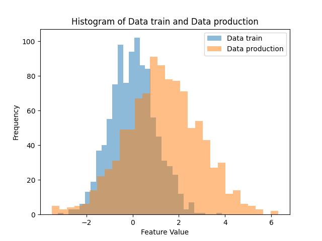

# Identifying Data Drift

Data drift occurs when the distribution of the input data changes over time.

Let's see in practice how to identify **data drift**. To do this, we will work with simulated data.

### Categorical Features

The first scenario will involve the analysis of **categorical features**.

Let's simulate a categorical variable used by a model. This feature takes the values *married*, *single* and *divorced* and we want to check whether the variable has the same distribution in the production data when compared to the training data.

To generate the data, use:

```python
import numpy as np
import matplotlib.pyplot as plt

categories = ['Single', 'Married', 'Divorced']

# Generate two example datasets
dataset_train = np.random.choice(categories, size=1000, p=[0.49, 0.3, 0.21])
dataset_prod = np.random.choice(categories, size=1000, p=[0.50, 0.3, 0.2])

# Print example of generated data
print(dataset_train)
```

Let's visually compare the feature at both times (training data and production data).

```python
# Calc frequencies
counts_train = [np.sum(dataset_train == category) for category in categories]
counts_prod = [np.sum(dataset_prod == category) for category in categories]

# Plot graph
plt.figure(figsize=(8, 6))

x = np.arange(len(categories))
width = 0.35

plt.bar(x - width / 2, counts_train, width, label="Dataset Train")
plt.bar(x + width / 2, counts_prod, width, label="Dataset Production")

plt.xlabel("Categories")
plt.ylabel("Frequency")
plt.title("Comparison of Dataset Train and Dataset Production")


plt.xticks(x, categories)
plt.legend()
plt.show()
```

Then, we will use Chi-square test to check goodness of fit. The hypotheses of the statistical test are:

- **Null hypothesis (H0)**: The observed frequencies in each category follow the expected theoretical distribution.

- **Alternative hypothesis (H1)**: The observed frequencies in at least one category do not follow the expected theoretical distribution.

The Python code is:

```python
from scipy.stats import chi2_contingency
# Create contingency table from the datasets
observed = np.array(
    [
        [
            np.sum(dataset_train == "Single"),
            np.sum(dataset_train == "Married"),
            np.sum(dataset_train == "Divorced"),
        ],
        [
            np.sum(dataset_prod == "Single"),
            np.sum(dataset_prod == "Married"),
            np.sum(dataset_prod == "Divorced"),
        ],
    ]
)

# Perform chi-squared test
chi2, p_value, _, _ = chi2_contingency(observed)

# Set significance level
alpha = 0.05

print(f"P-value: {p_value:.4f}")

# Check if there is a significant difference
if p_value < alpha:
    print(
        "Data drift detected: There is a significant difference in the categorical variable distribution."
    )
else:
    print(
        "No data drift detected: There is no significant difference in the categorical variable distribution."
    )

```

!!! exercise text long "Question!"
    Run the source codes. What decision is made by the statistical test?

    !!! answer "Answer!"
        The test probably fails to reject H0, that is, it does not identify data drift!

!!! exercise text long "Question!"
    Run the source codes with the update in probabilities:
    
    ```python
    # Generate two example datasets
    dataset_train = np.random.choice(categories, size=1000, p=[0.4, 0.3, 0.3])
    dataset_prod = np.random.choice(categories, size=1000, p=[0.5, 0.3, 0.2])
    ```
    
    What decision is made by the statistical test?

    !!! answer "Answer!"
        The test probably rejects H0, that is, identifies data drift!

### Continuos Features

To detect data drift for continuous features, we will use the **Kolmogorov-Smirnov (KS) test**.

The KS test is a statistical test used to assess the equality between two one-dimensional probability distributions. We will employ it to compare two samples to answer the question:

!!! info ""
    What is the likelihood that these two sets of samples were randomly selected from the same underlying probability distribution?

We can write the hypotheses of the statistical test as follows:

- **Null hypothesis (H0)**: The two samples come from the same distribution.

- **Alternative hypothesis (H1)**: The two samples do not come from the same distribution.

This way we will be able to evaluate whether the distribution of a continuum has changed over time.



Let's generate simulated data and perform hypothesis testing.

```python
import numpy as np
import matplotlib.pyplot as plt
from scipy.stats import ks_2samp

# Generate data from two distributions
np.random.seed(1234)
data_train = np.random.normal(loc=0, scale=1, size=1000)
data_prod = np.random.normal(loc=0.02, scale=1.01, size=1000)
```

We will build histograms to check the distribution of the feature at both times.

```python
# Plot histograms of the two distributions
plt.hist(data_train, bins=30, alpha=0.5, label="Data train")
plt.hist(data_prod, bins=30, alpha=0.5, label="Data production")
plt.xlabel("Feature Value")
plt.ylabel("Frequency")
plt.title("Histogram of Data train and Data production")
plt.legend()
plt.show()
```

Then, we use the KS test to make the decision whether or not there is data drift in the continuous variable.

```python
# Perform the Kolmogorov-Smirnov test
ks_statistic, p_value = ks_2samp(data_train, data_prod)

alpha = 0.05

# Print the KS test results
print(f"KS statistic: {ks_statistic:.4f}")
print(f"P-value: {p_value:.4f}")

# Check if there is a significant difference
if p_value < alpha:
    print(
        "Data drift detected: There is a significant difference in the continuos variable distribution."
    )
else:
    print(
        "No data drift detected: There is no significant difference in the continuos variable distribution."
    )
```

!!! exercise text long "Question!"
    Run the source codes. What decision is made by the statistical test?

    !!! answer "Answer!"
        The test probably fails to reject H0, that is, it does not identify data drift!

!!! exercise text long "Question!"
    Run the source codes with the update in probabilities:
    
    ```python
    # Generate two example datasets
    data_train = np.random.normal(loc=0, scale=1, size=1000)
    data_prod = np.random.normal(loc=0.5, scale=1.2, size=1000)
    ```
    
    What decision is made by the statistical test?

    !!! answer "Answer!"
        The test probably rejects H0, that is, identifies data drift!

!!! tip "Tip!"
    Keep in mind that monitoring model **performance degradation** is an **ongoing process**.
    
    It is advisable to monitor metrics in real-time and to implement **automated alerts** to notify your team when issues arise.