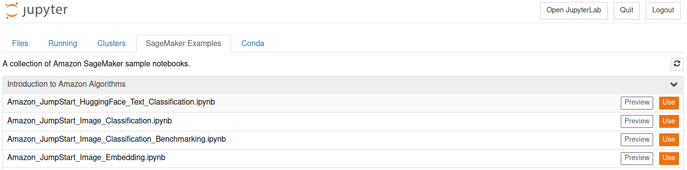

# Sagemaker

## Notebook Instances

Notebook instances in **AWS SageMaker** are used when you need an interactive development environment based on Jupyter Notebooks in the cloud.

**AWS Sagemaker notebook instances** work similarly to a Jupyter Lab or Notebooks that we use daily, but running on AWS. They will be particularly useful because they do not require extensive local resources when analyzing data.

!!! info ""
    This way you won't have to worry about whether your computer has enough RAM or processing power!

Furthermore, integration with AWS S3 and other resources will be easier, due to being in the AWS environment.

## Create Role

Let's start by creating a role that will allow our notebook instance to access AWS resources. We will need to create two JSON files: one for the trust policy and another for the assume role policy.

??? "File `assume-role.json`"
    ```json
    {
        "Version": "2012-10-17",
        "Statement": [
            {
                "Effect": "Allow",
                "Principal": {
                    "Service": "sagemaker.amazonaws.com"
                },
                "Action": "sts:AssumeRole"
            }
        ]
    }
    ```

??? "File `trust-policy.json`"
    ```json
    {
        "Version": "2012-10-17",
        "Statement": [
            {
                "Action": [
                    "cloudformation:CreateChangeSet",
                    "cloudformation:CreateStack",
                    "cloudformation:DescribeChangeSet",
                    "cloudformation:DeleteChangeSet",
                    "cloudformation:DeleteStack",
                    "cloudformation:DescribeStacks",
                    "cloudformation:ExecuteChangeSet",
                    "cloudformation:SetStackPolicy",
                    "cloudformation:UpdateStack"
                ],
                "Resource": "arn:aws:cloudformation:*:*:stack/sagemaker-*",
                "Effect": "Allow"
            },
            {
                "Action": [
                    "cloudwatch:PutMetricData"
                ],
                "Resource": "*",
                "Effect": "Allow"
            },
            {
                "Action": [
                    "codebuild:BatchGetBuilds",
                    "codebuild:StartBuild"
                ],
                "Resource": [
                    "arn:aws:codebuild:*:*:project/sagemaker-*",
                    "arn:aws:codebuild:*:*:build/sagemaker-*"
                ],
                "Effect": "Allow"
            },
            {
                "Action": [
                    "codecommit:CancelUploadArchive",
                    "codecommit:GetBranch",
                    "codecommit:GetCommit",
                    "codecommit:GetUploadArchiveStatus",
                    "codecommit:UploadArchive"
                ],
                "Resource": "arn:aws:codecommit:*:*:sagemaker-*",
                "Effect": "Allow"
            },
            {
                "Action": [
                    "codepipeline:StartPipelineExecution"
                ],
                "Resource": "arn:aws:codepipeline:*:*:sagemaker-*",
                "Effect": "Allow"
            },
            {
                "Action": [
                    "ec2:DescribeRouteTables"
                ],
                "Resource": "*",
                "Effect": "Allow"
            },
            {
                "Action": [
                    "ecr:BatchCheckLayerAvailability",
                    "ecr:BatchGetImage",
                    "ecr:Describe*",
                    "ecr:GetAuthorizationToken",
                    "ecr:GetDownloadUrlForLayer"
                ],
                "Resource": "*",
                "Effect": "Allow"
            },
            {
                "Effect": "Allow",
                "Action": [
                    "ecr:BatchDeleteImage",
                    "ecr:CompleteLayerUpload",
                    "ecr:CreateRepository",
                    "ecr:DeleteRepository",
                    "ecr:InitiateLayerUpload",
                    "ecr:PutImage",
                    "ecr:UploadLayerPart"
                ],
                "Resource": [
                    "arn:aws:ecr:*:*:repository/sagemaker-*"
                ]
            },
            {
                "Action": [
                    "events:DeleteRule",
                    "events:DescribeRule",
                    "events:PutRule",
                    "events:PutTargets",
                    "events:RemoveTargets"
                ],
                "Resource": [
                    "arn:aws:events:*:*:rule/sagemaker-*"
                ],
                "Effect": "Allow"
            },
            {
                "Action": [
                    "firehose:PutRecord",
                    "firehose:PutRecordBatch"
                ],
                "Resource": "arn:aws:firehose:*:*:deliverystream/sagemaker-*",
                "Effect": "Allow"
            },
            {
                "Action": [
                    "glue:BatchCreatePartition",
                    "glue:BatchDeletePartition",
                    "glue:BatchDeleteTable",
                    "glue:BatchDeleteTableVersion",
                    "glue:BatchGetPartition",
                    "glue:CreateDatabase",
                    "glue:CreatePartition",
                    "glue:CreateTable",
                    "glue:DeletePartition",
                    "glue:DeleteTable",
                    "glue:DeleteTableVersion",
                    "glue:GetDatabase",
                    "glue:GetPartition",
                    "glue:GetPartitions",
                    "glue:GetTable",
                    "glue:GetTables",
                    "glue:GetTableVersion",
                    "glue:GetTableVersions",
                    "glue:SearchTables",
                    "glue:UpdatePartition",
                    "glue:UpdateTable",
                    "glue:GetUserDefinedFunctions"
                ],
                "Resource": [
                    "arn:aws:glue:*:*:catalog",
                    "arn:aws:glue:*:*:database/default",
                    "arn:aws:glue:*:*:database/global_temp",
                    "arn:aws:glue:*:*:database/sagemaker-*",
                    "arn:aws:glue:*:*:table/sagemaker-*",
                    "arn:aws:glue:*:*:tableVersion/sagemaker-*"
                ],
                "Effect": "Allow"
            },
            {
                "Action": [
                    "iam:PassRole"
                ],
                "Resource": [
                    "arn:aws:iam::*:role/service-role/AmazonSageMakerServiceCatalogProductsUse*"
                ],
                "Effect": "Allow"
            },
            {
                "Effect": "Allow",
                "Action": [
                    "lambda:InvokeFunction"
                ],
                "Resource": [
                    "arn:aws:lambda:*:*:function:sagemaker-*"
                ]
            },
            {
                "Action": [
                    "logs:CreateLogDelivery",
                    "logs:CreateLogGroup",
                    "logs:CreateLogStream",
                    "logs:DeleteLogDelivery",
                    "logs:Describe*",
                    "logs:GetLogDelivery",
                    "logs:GetLogEvents",
                    "logs:ListLogDeliveries",
                    "logs:PutLogEvents",
                    "logs:PutResourcePolicy",
                    "logs:UpdateLogDelivery"
                ],
                "Resource": "*",
                "Effect": "Allow"
            },
            {
                "Effect": "Allow",
                "Action": [
                    "s3:CreateBucket",
                    "s3:DeleteBucket",
                    "s3:GetBucketAcl",
                    "s3:GetBucketCors",
                    "s3:GetBucketLocation",
                    "s3:ListAllMyBuckets",
                    "s3:ListBucket",
                    "s3:ListBucketMultipartUploads",
                    "s3:PutBucketCors",
                    "s3:PutObjectAcl"
                ],
                "Resource": [
                    "arn:aws:s3:::aws-glue-*",
                    "arn:aws:s3:::sagemaker-*"
                ]
            },
            {
                "Effect": "Allow",
                "Action": [
                    "s3:AbortMultipartUpload",
                    "s3:DeleteObject",
                    "s3:GetObject",
                    "s3:GetObjectVersion",
                    "s3:PutObject"
                ],
                "Resource": [
                    "arn:aws:s3:::aws-glue-*",
                    "arn:aws:s3:::sagemaker-*"
                ]
            },
            {
                "Effect": "Allow",
                "Action": [
                    "sagemaker:*"
                ],
                "NotResource": [
                    "arn:aws:sagemaker:*:*:domain/*",
                    "arn:aws:sagemaker:*:*:user-profile/*",
                    "arn:aws:sagemaker:*:*:app/*",
                    "arn:aws:sagemaker:*:*:flow-definition/*"
                ]
            },
            {
                "Action": [
                    "states:DescribeExecution",
                    "states:DescribeStateMachine",
                    "states:DescribeStateMachineForExecution",
                    "states:GetExecutionHistory",
                    "states:ListExecutions",
                    "states:ListTagsForResource",
                    "states:StartExecution",
                    "states:StopExecution",
                    "states:TagResource",
                    "states:UntagResource",
                    "states:UpdateStateMachine"
                ],
                "Resource": [
                    "arn:aws:states:*:*:stateMachine:sagemaker-*",
                    "arn:aws:states:*:*:execution:sagemaker-*:*"
                ],
                "Effect": "Allow"
            },
            {
                "Action": [
                    "states:ListStateMachines"
                ],
                "Resource": "*",
                "Effect": "Allow"
            },
            {
                "Effect": "Allow",
                "Action": [
                    "codestar-connections:UseConnection"
                ],
                "Resource": "arn:aws:codestar-connections:*:*:connection/*",
                "Condition": {
                    "StringEqualsIgnoreCase": {
                        "aws:ResourceTag/sagemaker": "true"
                    }
                }
            }
        ]
    }
    ```
!!! exercise "Question!"
    Create the JSON files `assume-role.json` and `trust-policy.json` with the contents above.

!!! tip "Tip!"
    Ensure that you have configured AWS credentials. Check this if you get any permission error.

    <p>
    <div class="termy">

    ```console
    $ aws configure list-profiles
    ```

    </div>
    </p>

!!! exercise "Question!"
    Create the **policy** by running:

    <p>
    <div class="termy">

    ```console
    $ aws iam create-policy \
        --policy-name SagemakerUsePolicy \
        --policy-document file://trust-policy.json \
        --profile mlops
    ```

    </div>
    </p>

!!! exercise "Question!"
    Create the **role** by running:

    <p>
    <div class="termy">

    ```console
    $ aws iam create-role \
        --role-name SagemakerUseRole \
        --assume-role-policy-document file://assume-role.json \
        --profile mlops
    ```

    </div>
    </p>

!!! exercise "Question!"
    Attach the **policy** to the **role** by running:

    !!! danger "Important!"
        Replace `XXXXXXXXXXXXXX` with your AWS account ID.

        You can also find the full *role-arn* in the output of the `aws iam create-role` command or by running:

        <p>
        <div class="termy">

        ```console
        $ aws iam get-role \
            --role-name SagemakerUseRole \
            --profile mlops \
            --query "Role.Arn" \
            --output text
        ```

        </div>
        </p>

    <p>
    <div class="termy">

    ```console
    $ aws iam attach-role-policy \
        --role-name SagemakerUseRole \
        --policy-arn "arn:aws:iam::XXXXXXXXXXXXXX:policy/SagemakerUsePolicy" \
        --profile mlops
    ```

    </div>
    </p>

## Create a Notebooks Instance

!!! exercise "Question!"
    To create a notebook instance, just run:

    !!! danger "Important!"
        Replace `XXXXXXXXXXXXXX` with your AWS account ID.

        You can also find the full *role-arn* in the output of the `aws iam create-role` command or by running:

        <p>
        <div class="termy">

        ```console
        $ aws iam get-role \
            --role-name SagemakerUseRole \
            --profile mlops \
            --query "Role.Arn" \
            --output text
        ```

        </div>
        </p>


    !!! danger "Important!"
        Replace `YOUR_INSPER_USERNAME` with your Insper user.

    <p>
    <div class="termy">

    ```console
    $ aws sagemaker create-notebook-instance \
        --notebook-instance-name "exp-note-YOUR_INSPER_USERNAME-01" \
        --role-arn "arn:aws:iam::XXXXXXXXXXXXXX:role/SagemakerUseRole" \
        --instance-type "ml.t2.medium" \
        --volume-size-in-gb 10 \
        --region us-east-1 \
        --profile mlops
    ```

    </div>
    </p>

    !!! Info "Important!"
        We define `ml.t2.medium` as the [VM type](https://aws.amazon.com/pt/sagemaker/pricing/) used by the instance. This is an important step as it will limit the amount of computing resources available to the notebook.

You will need to wait a few minutes for the instance to be available.

!!! exercise "Question!"
    To check the instance status, run:

    !!! danger "Important!"
        Replace `YOUR_INSPER_USERNAME` with your Insper user.

    !!! tip "Tip!"
        Repeat this process until the status changes from *Pending* to *InService*.

    <p>
    <div class="termy">

    ```console
    $ aws sagemaker describe-notebook-instance --notebook-instance-name "exp-note-YOUR_INSPER_USERNAME-01" -region us-east-1  --profile mlops
    ```

    </div>
    </p>

## Access the Instance

In order to access the notebook instance, we will create a presigned URL that will allow us to access the Jupyter Notebook running on AWS.

!!! exercise "Question!"
    Create a password for the notebook instance by running:

    !!! danger "Important!"
        Replace `YOUR_INSPER_USERNAME` with your Insper user.

    <p>
    <div class="termy">

    ```console
    $ aws sagemaker create-presigned-notebook-instance-url \
        --notebook-instance-name "exp-note-YOUR_INSPER_USERNAME-01" \
        --region us-east-1 \
        --profile mlops
    ```

    </div>
    </p>

!!! tip "Tip!"
    After accessing Jupyter Notebook, replace the end of the URL `/nbclassic/tree` with `/lab` if you want to access the Jupyter Lab version!

You are now accessing a Jupyter Notebook that is running on AWS! Let's bring some resources into this environment:

## Initial Exploration!


!!! exercise "Question!"
    Create a notebook **In your notebook instance in Sagemaker** with `conda_python3` kernel.

    We will use this notebook to download some other notebooks.

    Execute in any cell:

    ```console
    !wget https://mlops-material.s3.us-east-2.amazonaws.com/sagemaker/01-eda.ipynb
    !wget https://mlops-material.s3.us-east-2.amazonaws.com/sagemaker/02-train-model-on-instance.ipynb
    !wget https://mlops-material.s3.us-east-2.amazonaws.com/sagemaker/03-train-deploy.ipynb
    ```

!!! exercise "Question!"
    Open notebook `01-eda` **In your notebook instance in Sagemaker** and study its contents.

!!! exercise "Question!"
    Open notebook `02-train-model-on-instance.ipynb` **In your notebook instance in Sagemaker** and study its contents.

!!! exercise "Question!"
    Open notebook `03-train-deploy.ipynb` **In your notebook instance in Sagemaker** and study its contents.

# AWS Sagemaker Examples

!!! exercise "Question!"
    Access the **Sagemaker Examples** tab in the Jupyter Notebook root and check out the other example notebooks.

    

## Stop Instance

!!! danger "Important!"
    Delete resources at the end of class!

To prevent unnecessary resource expenditure, instances can be stopped and restarted as needed.

To **start**:

!!! danger "Important!"
    Replace `YOUR_INSPER_USERNAME` with your Insper user.

<p>
<div class="termy">

```console
$ aws sagemaker start-notebook-instance --notebook-instance-name "exp-note-YOUR_INSPER_USERNAME-01"
```

</div>
</p>

To **stop**:

!!! danger "Important!"
    Replace `YOUR_INSPER_USERNAME` with your Insper user.

<p>
<div class="termy">

```console
$ aws sagemaker stop-notebook-instance --notebook-instance-name "exp-note-YOUR_INSPER_USERNAME-01"
```

</div>
</p>

To **delete**:

!!! danger "Important!"
    Replace `YOUR_INSPER_USERNAME` with your Insper user.

<p>
<div class="termy">

```console
$ aws sagemaker delete-notebook-instance --notebook-instance-name "exp-note-YOUR_INSPER_USERNAME-01"
```

</div>
</p>


## References
- Beginning MLOps with MLFlow. Chapter 5.
- https://docs.aws.amazon.com/sagemaker/latest/dg/whatis.html
