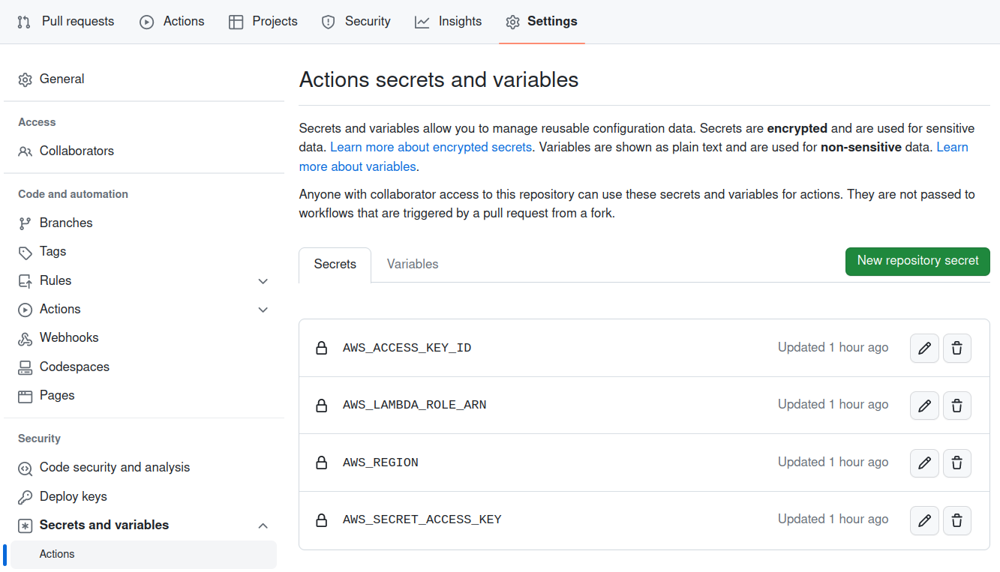
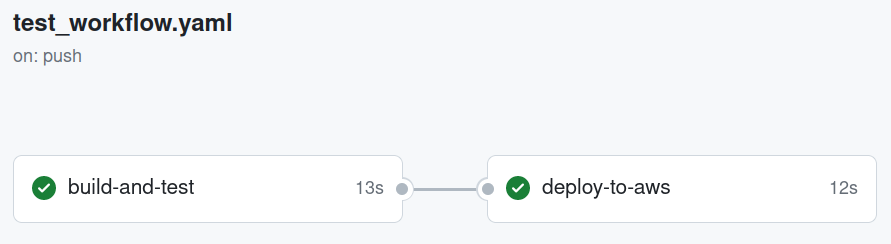

# Automate Deploy

Let's automate the deployment of the lambda function on AWS.


Whenever a `commit` occurs in *main*, the *action* will be triggered and will run two **jobs**:

- The first will run the automatic tests.
- If the first job is successful, the second job will deploy the function to AWS.

## Create Deploy Python Script

At some point in the action on github, we will need to communicate with AWS for the function to be deployed. This can be done in several ways, such as:

- Python script (like we have been doing in class)
- AWS CLI
- AWS SAM

Among others.

Let's do a first example using Python Script.

!!! exercise "Question"
    Create a `deploy` folder at root directory.

    This directory will be used to store deploy scripts, like the one we will use to create the lambda function.

!!! exercise "Question"
    Create the file `deploy/requirements_deploy.txt` with the content:

    ```python
    boto3
    ```

    This file will contain the dependencies of the **action**, not the **lambda function**.

!!! exercise "Question"
    Create the file `deploy/create_function.py` with the content:

    ```python
    import boto3
    import os

    # Provide function name: wc_INSPER_USERNAME
    function_name = ""

    lambda_client = boto3.client(
        "lambda",
        aws_access_key_id=os.getenv("AWS_ACCESS_KEY_ID"),
        aws_secret_access_key=os.getenv("AWS_SECRET_ACCESS_KEY"),
        region_name=os.getenv("AWS_REGION"),
    )

    lambda_role_arn = os.getenv("AWS_LAMBDA_ROLE_ARN")

    with open("word_count.zip", "rb") as f:
        zip_to_deploy = f.read()

    lambda_response = lambda_client.create_function(
        FunctionName="function_name",
        Runtime="python3.10",
        Role=lambda_role_arn,
        Handler="word_count.word_count_handler",
        Code={"ZipFile": zip_to_deploy},
    )

    ```

    Now the file tree will be:

    ```console
    .
    ├── deploy
    │   ├── create_function.py
    │   └── requirements_deploy.txt
    ├── .github
    │   └── workflows
    │       └── test_workflow.yaml
    ├── .gitignore
    ├── pytest.ini
    ├── README.md
    ├── requirements.txt
    ├── src
    │   └── word_count.py
    └── tests
        └── test_word_count.py
    ```

## Create Job: Github Action

Let's create a new **job** in the github action workflow.


!!! exercise "Question"
    To do this, update the `.github/workflows/test_workflow.yaml` file:

    ```yaml
    name: An example of action with two jobs - one for testing, one for aws lambda deploy
    on:
      push:
        branches:
          - main
    jobs:
      build-and-test:
        runs-on: ubuntu-latest
        steps:

          - name: Checkout code
            uses: actions/checkout@v3

          - name: Set up Python
            uses: actions/setup-python@v3
            with:
              python-version: '3.10'

          - name: Install dependencies
            run: pip install -r requirements.txt

          - name: Run tests
            run: pytest

      deploy-to-aws:
        needs: build-and-test
        runs-on: ubuntu-latest
        env:
          AWS_ACCESS_KEY_ID: ${{ secrets.AWS_ACCESS_KEY_ID }}
          AWS_SECRET_ACCESS_KEY: ${{ secrets.AWS_SECRET_ACCESS_KEY }}
          AWS_REGION: ${{ secrets.AWS_REGION }}
          AWS_LAMBDA_ROLE_ARN: ${{ secrets.AWS_LAMBDA_ROLE_ARN }}
        steps:

          - name: Checkout code
            uses: actions/checkout@v3

          - name: Zip Python file
            run: |
              zip -j word_count.zip src/word_count.py

          - name: Set up Python
            uses: actions/setup-python@v3
            with:
              python-version: '3.10'

          - name: Install dependencies
            run: pip install -r deploy/requirements_deploy.txt

          - name: Run deploy file
            run: python deploy/create_function.py

    ```

!!! tip "Tip!"
    Notice the new `deploy-to-aws` job!

The `deploy-to-aws` job is very similar to the previous one (repository checkout, install python, install dependencies). The main differences are:

- **Concurrency**: Note that the job has `needs: build-and-test`. This will define that jobs must run in **sequence** and never in parallel. So, if the test fails there will be no deploy!

- **Variables**: check the `env` section, where we define some secret variables. We will explore this topic further in the next subsection.

- **ZIP**: we will deploy the lambda function using **ZIP**. Thus, this file will be created inside the container and used immediately afterwards.

- **Run deploy file**: The python script that creates the lambda function is called at the end of the job.

## Secrets: Github Action

Secrets allow you to **store sensitive information** in your organization, repository, or repository environments. They are variables that you create in an organization, repository, or repository environment.

The secrets that you create are available to use in GitHub Actions workflows. We will use them to store AWS credentials, as it wouldn't make sense to keep a file in the repository with such information! 

!!! tip "Tip!"
    GitHub Actions can only read a secret if you **explicitly include** the secret in a workflow.

    This is why the `env` section exists in the workflow!


See more [**Here**](https://docs.github.com/en/actions/security-guides/using-secrets-in-github-actions) and [**Here**](https://docs.github.com/en/actions/learn-github-actions/variables).

In order to find the repository secrets configuration, go to the repository site on github / settings / Secrets and variables / Actions.



!!! exercise text long "Question"
    In our workflow, which information could be variables and which needs to be secret?

    !!! answer "Answer"
        Both `AWS_ACCESS_KEY_ID` and `AWS_SECRET_ACCESS_KEY` are very sensitive and definitely secrets.
        
        The  `AWS_LAMBDA_ROLE_ARN` has our account id. It's not the end of the world for this information to leak, but it's best not to share it and leave it as a secret.

        The `AWS_REGION` could be a variable (but let's use secrets for ease).

        Other information such as the function name could be variables instead of being hard coded.

!!! exercise "Question"
    Go to the secrets configuration sections and set all secrets used in the workflow:

    - AWS_ACCESS_KEY_ID
    - AWS_SECRET_ACCESS_KEY
    - AWS_REGION
    - AWS_LAMBDA_ROLE_ARN


## Commit and Deploy!

!!! exercise "Question"
    Commit and push and check if the action executes successfully.

    

!!! exercise "Question"
    Test the function to check if it works!
    
    You can use the code:

    ??? "Code to Test Lambda Function: Click to expand!"
        ```python
        import io
        import boto3
        import json

        # Lambda function name: wc_INSPER_USERNAME
        function_name = ""

        # Create a Boto3 client for AWS Lambda
        lambda_client = boto3.client("lambda")

        msg = {"body": "hello from mars"}

        try:
            print(f"Message:\n{msg}")

            response = lambda_client.invoke(
                FunctionName=function_name,
                InvocationType="RequestResponse",
                Payload=json.dumps(msg),
            )

            payload = response["Payload"]

            txt = io.BytesIO(payload.read()).read().decode("utf-8")
            print(f"\nResponse:\n{txt}")
        except Exception as e:
            print(e)

        ```

## Task

!!! exercise "Question"
    Make any changes to the function handler. For example, return one more field with the number of spaces.

    Test whether automatic deployment occurs when pushing to main.

    !!! danger "Attention!"
        Remember that our script **creates** the function. You will have to remove the function for the deploy to work!

!!! exercise "Question"
    Change the deploy Python script to check if the function already exists.

    - If so, just update the function code.

    - If not, then the function is created (as we already do).

## References
- Introducing MLOps. Chapter 6.
- Practical MLOps. Chapter 4.
- https://www.redhat.com/pt-br/topics/devops/what-is-ci-cd
- CI/CD Image: https://www.redhat.com/rhdc/managed-files/styles/wysiwyg_full_width/private/ci-cd-flow-desktop.png?itok=NNRD1Zj0