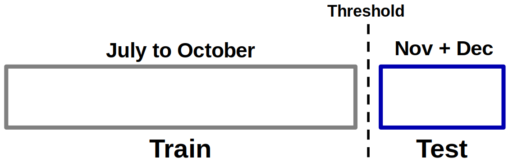

# Performance Degradation

We discussed in the last topics that the model is expected to lose performance over time.

!!! exercise choice "Question"
    Is it possible to have an idea, during the model construction process, of how much its performance will degrade over time?

    - [X] Yes
    - [ ] No

    !!! answer "Answer"
        We'll see in this handout!

## Important!

The following validation workflow may be helpful when building a predictive model involving time:



Instead of randomly splitting the samples to build the **training** and **test** sets, we make a cut in time so that data before this cut belongs to the training set and data after this cut belong to the test set.

## Check Degradation

To check the degradation of the model over time **in advance**, before the model is in production, what can be done is:

!!! danger ""
    Calculate the accuracy **per day** (consider the time granularity used in the project) and project it in a bar graph so that the expected degradation is visible.

!!! danger "Attention!"
    This experiment represents the expected behavior based on evidence already present in the data used during model construction.

    Other events may still occur (changes in user behavior) so that the model's performance degrades even more quickly.

## Simulate that!

Let's simulate some data and check this idea in practice!

### No degradation

In the first scenario, we will generate random data without much change in the data over time, i.e. there will be no visible significant degradation.

Import from libraries:

```python
import pandas as pd
import numpy as np
import plotly.express as px
from sklearn.ensemble import RandomForestClassifier
from sklearn.datasets import make_classification
from sklearn.metrics import (
    accuracy_score,
    confusion_matrix,
    ConfusionMatrixDisplay,
)
```

Generate random data:

```python
# Generate a simulated dataset
X, y = make_classification(
    n_samples=300*100,
    n_features=10,
    n_informative=5,
    n_redundant=2,
    random_state=42
)

start_date = pd.to_datetime("2023-01-01")
num_days = X.shape[0] // 50  # Number of days based on batch size
dates = pd.date_range(start=start_date, periods=num_days, freq="D").repeat(100)

# Create a DataFrame from the simulated data and the dates column
df = pd.DataFrame(X, columns=[f"Feature_{i}" for i in range(1, 11)])
df["Label"] = y
df["Date"] = dates[:X.shape[0]]

df.head()
```

```python
X = df.drop(["Label", "Date"], axis=1)
y = df["Label"]
```

```python
filter_train = df["Date"] < "2023-10-01"

X_train = X.loc[filter_train, :]
X_test = X.loc[~filter_train, :]

y_train = y.loc[filter_train]
y_test = y.loc[~filter_train]
date_test = df.loc[~filter_train, "Date"]
```

```python
clf = RandomForestClassifier(n_estimators=100, max_depth=5, random_state=42)
clf.fit(X_train, y_train)

y_pred = clf.predict(X_test)
print(f"Accuracy score: {accuracy_score(y_test, y_pred):.2f}")
```

```python
df_pred = pd.DataFrame({"y_true": y_test, "y_pred": y_pred, "date": date_test})
accuracy_by_date = df_pred.groupby("date").apply(lambda x: accuracy_score(x["y_true"], x["y_pred"]))
accuracy_by_date = accuracy_by_date.reset_index()
accuracy_by_date.columns = ["date", "accuracy"]

px.bar(accuracy_by_date, x="date", y="accuracy", title="Model Performance Over Time")
```


### With degradation

Now let's simulate a change in the data over time by adding date-dependent noise.

```python
noise_magnitude = np.arange(1, len(X_test) + 1)/len(X_test) * 7.5
np.random.seed(1234)
noise = np.random.normal(0, noise_magnitude[:, np.newaxis], size=X_test.shape)
X_test_noise = X_test + noise
```

We can see that the model now loses performance as the prediction data moves further away from the training cutoff date.

```python
y_pred_noise = clf.predict(X_test_noise)

print(f"Accuracy score: {accuracy_score(y_test, y_pred_noise):.2f}")

df_pred_noise = pd.DataFrame({"y_true": y_test, "y_pred": y_pred_noise, "date": date_test})
accuracy_by_date_noise = df_pred_noise.groupby("date").apply(lambda x: accuracy_score(x["y_true"], x["y_pred"]))
accuracy_by_date_noise = accuracy_by_date_noise.reset_index()
accuracy_by_date_noise.columns = ["date", "accuracy"]
accuracy_by_date_noise

px.bar(accuracy_by_date_noise, x="date", y="accuracy", color="accuracy", title="Performance Decrease Over Time")
```

!!! tip "Tip!"
    In this case, you would have a minimal idea of the intensity of the loss in performance of your model when it goes into production.


!!! exercise "Question!"
    Change the simulation parameters and analyze the results.
    
    Make sure you understand what is happening!

!!! exercise text short "Question!"
    What to do when the model's performance is below acceptable?

    !!! answer "Answer!"
        Retrain the model, get more data, get more features, test new methods!

!!! exercise text short "Question!"
    What type of practical decision would you already have an idea of how to make in production based on analyzing the graph above?

    !!! answer "Answer!"
        Time interval at which the model is retrained.
